# Southlake UI — Frontend Developer Handover Document

**Project**: Southlake UI (Angular 22 frontend for the Southlake Insurance platform)
**Audience**: A new developer joining the project with zero prior context
**Scope**: This document describes only what exists in the codebase at `southlake_ui/` as of this writing. It does not describe planned or aspirational features unless explicitly marked as such.
**Backend**: A separate NestJS service (`southlake_service`), consumed entirely over `HttpClient` at `environment.apiUrl`.

> **A note on scope accuracy.** The original outline for this document requested chapters named "Reports" and the module list included examples like "Programs" and "Companies." After analyzing the actual codebase, no module literally named "Reports" or "Programs" exists. Where the outline's assumptions didn't match the real code, this document follows the real code and says so explicitly (see Chapter 9). Nothing below is invented — every file path, class name, function name, route, and API endpoint has been verified against the actual source.

---

## Table of Contents

1. [Project Overview](#1-project-overview)
2. [Application Startup Flow](#2-application-startup-flow)
3. [Login Flow](#3-login-flow)
4. [Dashboard](#4-dashboard)
5. [User Management](#5-user-management)
6. [Masters Module](#6-masters-module)
7. [MGA Module (Deep Dive)](#7-mga-module-deep-dive)
8. [Accounting & Calculation Modules](#8-accounting--calculation-modules-chart-of-accounts-journal-entries-test-balance-reinsurance-calculations)
9. [Reports](#9-reports)
10. [Activity Logs](#10-activity-logs)
11. [Routing Documentation](#11-routing-documentation)
12. [Components Documentation](#12-components-documentation)
13. [Services Documentation](#13-services-documentation)
14. [Shared Components](#14-shared-components)
15. [Forms Documentation](#15-forms-documentation)
16. [State Management](#16-state-management)
17. [Guards & Interceptors](#17-guards--interceptors)
18. [Complete User Journey](#18-complete-user-journey)
19. [Diagrams](#19-diagrams)
20. [Developer Handover Notes](#20-developer-handover-notes)

---

## 1. Project Overview

**Southlake UI** is the Angular frontend for the Southlake Insurance platform. It provides the complete UI for authentication (email + OTP two-factor login), user management, role/permission configuration, chart of accounts, journal entries, test balance, reinsurance calculations, and master data — all consumed from a separate NestJS backend (`southlake_service`) over `HttpClient`.

**Angular version:** `^22.0.0` (per `package.json` — `@angular/core`, `@angular/router`, `@angular/common`, `@angular/forms`, `@angular/animations`, `@angular/platform-browser` are all pinned to `^22.0.0`). TypeScript `~6.0.0`, RxJS `~7.8.0`, Node.js `>=24.0.0`.

**Component style:** 100% standalone components — there are no `NgModule` declarations anywhere in `src/app`. Every `@Component` decorator seen (`AppComponent`, `MainLayoutComponent`, `SidebarComponent`, `HeaderComponent`, `ToastComponent`, `ConfirmDialogComponent`, etc.) sets `standalone: true` (or, on newer-generated files, omits the flag because it is the Angular 22 default) and declares its own `imports: [...]` array. Routing is wired via `loadComponent` / `loadChildren` functions returning dynamic `import()`s rather than `NgModule`-based lazy modules.

**Folder organization** (`src/app/`):

| Folder | Contents |
|---|---|
| `core/` | Global singletons only: `models/` (cross-feature interfaces), `services/` (`AuthService`, `AgGridConfigService`), `guards/` (`auth.guard.ts`, `permission.guard.ts`), `interceptors/` (`auth.interceptor.ts`) |
| `shared/` | Pure, stateless, reusable UI: `components/` (toast, confirm-dialog, loading-spinner, dropdown-search, notes-modal, grid-renderers/*) and `utils/` (`debounced-search.util.ts`) |
| `layout/` | The app shell: `state/sidebar.state.ts`, `main-layout/`, `sidebar/`, `header/` |
| `features/` | Lazy-loaded, feature-sliced modules: `auth/`, `dashboard/`, `chart-of-accounts/`, `journal-entries/`, `masters/`, `reinsurance-calculations/`, `test-balance/`, `user-management/` — each owns its own `models/`, `services/`, and sub-components |

This is a deliberate **feature-sliced architecture** (per `README.md`): a service or model used by more than one feature is *not* automatically promoted to `core/` — it stays in whichever feature most naturally owns it (e.g. `ChartOfAccountsApi` lives in `features/chart-of-accounts/services/` even though `journal-entries` and `masters` also import it). `core/` is reserved for things every feature needs regardless of domain (auth, guards, interceptors, ag-Grid defaults).

**Routing architecture:** Every route in `src/app/app.routes.ts` is lazy-loaded — leaf routes use `loadComponent: () => import(...).then(m => m.XComponent)`, and routes with sub-routes (`auth`, `user-management`, `masters`) use `loadChildren: () => import('./x.routes').then(m => m.xRoutes)`. The root route tree wraps everything except `/auth/*` inside `MainLayoutComponent`, which is guarded by `authGuard`; individual feature branches additionally apply `permissionGuard('<module>')`.

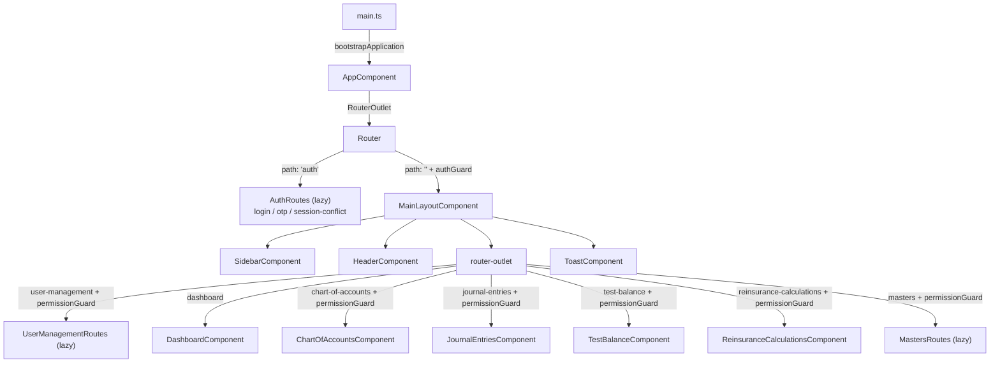

---

## 2. Application Startup Flow

**Step 1 — `src/main.ts`:**

```ts
ModuleRegistry.registerModules([AllCommunityModule]);   // ag-Grid community modules registered once, globally
bootstrapApplication(AppComponent, appConfig).catch(err => console.error(err));
```
`bootstrapApplication` boots the standalone `AppComponent` directly (no `AppModule`), applying the providers from `appConfig`.

**Step 2 — `src/app/app.config.ts` providers** (exact array):

```ts
export const appConfig: ApplicationConfig = {
  providers: [
    provideZoneChangeDetection({ eventCoalescing: true }),
    provideRouter(routes, withComponentInputBinding()),
    provideHttpClient(withInterceptors([authInterceptor])),
    provideAnimations(),
  ],
};
```

| Provider | Purpose |
|---|---|
| `provideZoneChangeDetection({ eventCoalescing: true })` | Configures Zone.js-based change detection; `eventCoalescing: true` batches multiple DOM events firing in the same tick into a single change-detection pass (perf optimization). |
| `provideRouter(routes, withComponentInputBinding())` | Registers the Angular Router with the top-level `routes` array from `app.routes.ts`. `withComponentInputBinding()` lets routed components receive route params/data/query-params as `@Input()`-bound component inputs automatically. |
| `provideHttpClient(withInterceptors([authInterceptor]))` | Registers `HttpClient` with the functional interceptor `authInterceptor` (from `core/interceptors/auth.interceptor.ts`) wired into every outgoing HTTP request. |
| `provideAnimations()` | Enables the Angular animations engine (`@angular/platform-browser/animations`), needed for any component using Angular's animation API. |

**Step 3 — Router matches `''`.** `app.routes.ts` root array:
```ts
{ path: '', redirectTo: 'auth/login', pathMatch: 'full' },
```
So a fresh navigation to `/` immediately redirects to `/auth/login`, which resolves via the lazy-loaded `authRoutes` (`src/app/features/auth/auth.routes.ts`).

**Step 4 — `AppComponent` (`src/app/app.component.ts`).** Its template (`app.component.html`) is just `<router-outlet />`. `ngOnInit()` checks `authService.isLoggedIn()` (token present in localStorage); if true it calls `authService.fetchCurrentUser()` (`GET /auth/me`) and on success re-persists the fresh user via `authService.storeSession({ user })` — this silently refreshes cached permissions on every full page load without blocking rendering. A 401 here is swallowed (comment: "Handled by auth interceptor if it is a 401").

**Step 5 — Once authenticated,** the router activates the second top-level route entry:
```ts
{
  path: '',
  component: MainLayoutComponent,
  canActivate: [authGuard],
  children: [ ... ]
}
```
`authGuard` runs first; if it passes, `MainLayoutComponent` is instantiated (see its template: `<app-sidebar/>`, `<app-header/>`, `<router-outlet/>` inside `.layout-content`, plus `<app-toast/>`).

**Step 6 — Default child-route redirect.** Inside `MainLayoutComponent`'s children array, the last entry is:
```ts
{ path: '', redirectTo: 'user-management/users', pathMatch: 'full' },
```
So navigating to the bare app root (post-auth) lands on `/user-management/users`, not `/dashboard` — despite `dashboard` being described elsewhere as the "main landing page," the actual code-level default redirect target is `user-management/users`. This route additionally carries `canActivate: [permissionGuard('user_management')]` at the parent `user-management` path level, so a logged-in user without `user_management.view` permission is bounced onward to `/dashboard` by `permissionGuard`.

**Step 7 — Wildcard fallback:** `{ path: '**', redirectTo: 'auth/login' }` catches any unmatched URL and sends the user to the login page.

---

## 3. Login Flow

### 3.1 Reaching the login screen

The app's root route table (`src/app/app.routes.ts`) redirects the empty path straight into the auth module:

```ts
{ path: '', redirectTo: 'auth/login', pathMatch: 'full' },
{ path: 'auth', loadChildren: () => import('./features/auth/auth.routes').then(m => m.authRoutes) },
```

Inside the lazy-loaded auth module, `src/app/features/auth/auth.routes.ts` (`authRoutes`) additionally redirects its own empty path to `login`, and declares the three auth screens:

| Path (relative to `/auth`) | Component |
|---|---|
| `''` → redirects to `login` | — |
| `login` | `LoginComponent` (`src/app/features/auth/login/login.component.ts`) |
| `otp` | `OtpComponent` (`src/app/features/auth/otp/otp.component.ts`) |
| `session-conflict` | `SessionConflictComponent` (`src/app/features/auth/session-conflict/session-conflict.component.ts`) |

So an unauthenticated visit to `/` ends up at `/auth/login`. All three components are standalone and lazy-loaded via `loadComponent`.

### 3.2 LoginComponent

File: `src/app/features/auth/login/login.component.ts` / `login.component.html`.

**Form**: `form` is a `FormBuilder`-built `FormGroup` with:
- `email`: `['', [Validators.required, Validators.email]]`
- `password`: `['', [Validators.required]]`

(There is a second form, `inviteForm`, used only for the "accept invite" flow reached via a `?token=` query param — `password: [..., [Validators.required, Validators.minLength(8)]]`, `confirmPassword: [..., [Validators.required]]`, plus a custom group validator that returns `{ notSame: true }` when `password !== confirmPassword`. This is a parallel flow, not the standard login path.)

**Submit handler**: the form's `(ngSubmit)="onSubmit()"` binds to `LoginComponent.onSubmit()`. It guards on `this.form.invalid || this.loading`, sets `loading = true`, clears `errorMsg`, and calls:

```ts
this.auth.login(email, password)
```

which is `AuthService.login()` in `src/app/core/services/auth.service.ts`, issuing:

- **`POST ${environment.apiUrl}/auth/login`** with body `{ email, password }` (`environment.apiUrl` = `http://localhost:3000/api`, from `src/environments/environment.ts`).

**On success**: `LoginComponent.onSubmit()`'s `next` callback sets `loading = false` and navigates with `this.router.navigate(['/auth/otp'], { state: { email, password } })` — the email/password are passed via Angular Router navigation `state`, not query params or storage.

**On error**: the `error` callback sets `this.errorMsg = err?.error?.message ?? 'Invalid email or password.'`. The template binds this with `@if (errorMsg) { <div class="auth-error">{{ errorMsg }}</div> }` in `login.component.html` — a plain component property (not a signal), re-rendered via Angular's default change detection (`this.cdr.markForCheck()` is also called explicitly after each async response).

There is a secondary, unrelated code path in the same component for accepting an admin invite (`isInviteFlow`, populated when the route has a `token` query param, calling `AuthService.getInviteDetails()` → `GET /auth/invite-details` and, on submit, `AuthService.acceptInvite()` → `POST /auth/accept-invite`, which on success calls `this.auth.storeSession(res)` and navigates to `/user-management/users` directly, skipping OTP). This is not part of the normal email/password login flow.

### 3.3 OtpComponent

File: `src/app/features/auth/otp/otp.component.ts` / `otp.component.html`.

The component reads `email`/`password` out of the router navigation state in its constructor (`this.router.getCurrentNavigation()?.extras?.state ?? history.state`). If no `email` is present it immediately redirects back to `/auth/login`.

**6-digit input behavior** — the template renders 6 `<input>` elements (`#digitInput`, `maxlength="1"`) bound to `digits: string[]`:

- **Auto-focus-next**: `onInput(event, index)` strips non-digits (`input.value.replace(/\D/g, '').slice(-1)`), stores the digit in `digits[index]`, and if a value was entered and `index < 5`, focuses `inputs[index + 1]` via the `@ViewChildren('digitInput') digitInputs` query list.
- **Backspace**: `onKeyDown(event, index)` — if the current box is already empty, it clears the *previous* box (`digits[index-1] = ''`) and moves focus back to it; if the current box has a value, it just clears that box in place. Arrow keys (`ArrowLeft`/`ArrowRight`) also move focus between boxes.
- **Paste-fill**: `onPaste(event)` prevents default, extracts digits from `event.clipboardData.getData('text')` (`replace(/\D/g, '').slice(0, 6)`), fills all 6 `digits`/input values, and focuses the first empty box (or the last box if all 6 were filled).
- **Auto-submit**: both `onInput` and `onPaste` check `isComplete()` (`digits.every(d => d.length === 1)`) and, if true, call `setTimeout(() => this.submit(), 50)`.

**Verification**: `submit()` calls `this.auth.verifyOtp(this.email, otp)` → `AuthService.verifyOtp()` in `auth.service.ts`, which issues:

- **`POST ${environment.apiUrl}/auth/verify-otp`** with body `{ email, otp }`, returning a `SessionToken` (`src/app/core/models/session.model.ts`).

**Two outcomes**, both handled in `submit()`'s `next` callback, branching on `session.token_type`:
- **`SessionTokenType.Session` (`'session'`)**: calls `this.auth.storeSession(session)`, then `this.router.navigate(['/user-management/users'])`.
- **anything else (i.e. `'challenge'`)**: navigates to `this.router.navigate(['/auth/session-conflict'], { state: { session, email: this.email } })`, without storing a session — the token is still just a `challenge_token` at this point.

On error, `errorMsg` is set from `err?.error?.message` (fallback `'Invalid or expired code. Please try again.'`), all 6 digit boxes are cleared, and focus returns to the first box.

`resend()` simply re-invokes `AuthService.login(email, password)` (same `POST /auth/login` endpoint) using the cached email/password from the router state, to trigger a fresh OTP.

### 3.4 Token storage

`AuthService.storeSession(data)` in `auth.service.ts` is the single place tokens are persisted, using two `localStorage` keys defined as module-level constants:

- `SESSION_TOKEN_KEY = 'sl_session_token'` — set from `data.session_token` when present.
- `CURRENT_USER_KEY = 'sl_current_user'` — set from `JSON.stringify(data.user)` when present.

It is called from `OtpComponent.submit()` (session outcome), `SessionConflictComponent.signInHere()`, and `LoginComponent.onAcceptInviteSubmit()` (invite flow). Reads go through `AuthService.getToken()` (`localStorage.getItem(SESSION_TOKEN_KEY)`), `AuthService.isLoggedIn()` (`!!this.getToken()`), and `AuthService.getCurrentUser()` (`JSON.parse(localStorage.getItem(CURRENT_USER_KEY))`).

### 3.5 SessionConflictComponent

File: `src/app/features/auth/session-conflict/session-conflict.component.ts` / `session-conflict.component.html`.

It reads `session` and `email` from router state (constructor); if `session?.challenge_token` is missing it redirects to `/auth/login`. It stores `challengeToken = session.challenge_token` and `existingDevice = session.existing_device ?? null`, and renders a "Already Signed In" card showing the existing device's `label`, `ip`, and `created_at` (formatted by `formatDate()`).

- **"Sign In Here" button** → `(click)="signInHere()"`. This calls `AuthService.resolveChallenge(this.challengeToken, true)`, issuing **`POST ${environment.apiUrl}/auth/resolve-challenge`** with body `{ challenge_token, accept: true }`. On success it calls `this.auth.storeSession(session)` and navigates to `/user-management/users`. On error, `errorMsg` is set and shown the same `@if (errorMsg)` pattern as the other screens.
- **"Cancel"** is a plain `routerLink="/auth/login"` anchor — it does **not** call any `AuthService` method or API endpoint; it only navigates away. (Note: `AuthService.resolveChallenge()` accepts an `accept: boolean` parameter, implying a decline/`accept:false` path could exist, but no code in `SessionConflictComponent` ever invokes it with `false`.)

### 3.6 permissionGuard interaction

Authenticated, non-conflicted users land on protected routes guarded by `authGuard` (`src/app/core/guards/auth.guard.ts`) at the `MainLayoutComponent` level in `app.routes.ts`, and additionally by `permissionGuard(...)` (`src/app/core/guards/permission.guard.ts`) on specific feature children (e.g. `canActivate: [permissionGuard('user_management')]` for `/user-management`). Full guard mechanics are covered in [Chapter 17](#17-guards--interceptors).

### 3.7 Logout flow

Logout is triggered from the user-menu dropdown in `src/app/layout/header/header.component.html`, via the "Sign Out" button bound to `(click)="signOut($event)"`, handled in `src/app/layout/header/header.component.ts`:

```ts
signOut(event: Event): void {
  event.stopPropagation();
  this.dropdownOpen = false;
  this.auth.logout();
}
```

`AuthService.logout()` (`auth.service.ts`):
1. If a token exists (`getToken()`), fires `POST ${environment.apiUrl}/auth/logout` with an empty body, subscribing with `{ error: () => {} }` — i.e. it's fire-and-forget and ignores failures.
2. Removes both `localStorage` keys: `sl_session_token` and `sl_current_user`.
3. Calls `this.router.navigate(['/auth/login'])`, returning the user to the login screen.

### Sequence diagram

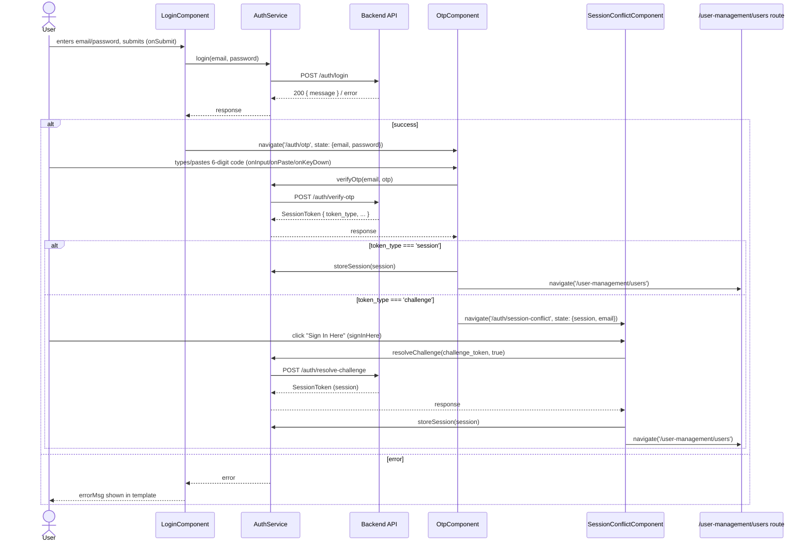

### API endpoint summary

| HTTP Method | Endpoint (relative to `environment.apiUrl`) | Calling `AuthService` method | Calling component |
|---|---|---|---|
| POST | `/auth/login` | `login(email, password)` | `LoginComponent.onSubmit()`; also `OtpComponent.resend()` |
| POST | `/auth/verify-otp` | `verifyOtp(email, otp)` | `OtpComponent.submit()` |
| POST | `/auth/resolve-challenge` | `resolveChallenge(challengeToken, accept)` | `SessionConflictComponent.signInHere()` |
| POST | `/auth/logout` | `logout()` | `HeaderComponent.signOut()` |
| GET | `/auth/invite-details` | `getInviteDetails(token)` | `LoginComponent.loadInviteDetails()` (invite flow, triggered by `?token=` query param) |
| POST | `/auth/accept-invite` | `acceptInvite(token, password)` | `LoginComponent.onAcceptInviteSubmit()` (invite flow) |
| GET | `/auth/me` | `fetchCurrentUser()` | Called by `AppComponent.ngOnInit()` (session refresh) and by `permissionGuard` on every guarded navigation — not called from any file inside `features/auth` itself |

---

## 4. Dashboard

### Purpose

The Dashboard is the landing/home page of Southlake UI's authenticated area. It is currently a **static placeholder screen** — there is no live data, no widgets, no charts, and no backend integration implemented yet. The page exists purely to hold the route and communicate to users that analytics/reporting is forthcoming.

### Route

Registered in `src/app/app.routes.ts` (lines 25–29), as a child of the top-level route guarded by `MainLayoutComponent`:

```ts
{
  path: 'dashboard',
  loadComponent: () =>
    import('./features/dashboard/dashboard.component').then(m => m.DashboardComponent),
},
```

- Path: `dashboard` (lazy-loaded via `loadComponent`, no separate `.routes.ts` file for this feature).
- Parent route: `{ path: '', component: MainLayoutComponent, canActivate: [authGuard], children: [...] }` — so the dashboard renders inside `MainLayoutComponent` and requires the user to pass `authGuard` to be reached. Unlike sibling routes such as `user-management` or `chart-of-accounts`, the `dashboard` route has **no `permissionGuard`** applied — any authenticated user can access it.
- The app's root redirect (`{ path: '', redirectTo: 'auth/login', pathMatch: 'full' }`) does not point here; there is no explicit redirect to `/dashboard` after login anywhere in the routing files (the actual post-login default is `/user-management/users` — see Chapter 2, Step 6).

### Component

File: `src/app/features/dashboard/dashboard.component.ts`

```ts
@Component({
  selector: 'app-dashboard',
  standalone: true,
  imports: [],
  templateUrl: './dashboard.component.html',
  styleUrl: './dashboard.component.scss',
})
export class DashboardComponent {}
```

- `DashboardComponent` is a standalone component with an **empty class body** — no properties, no constructor, no injected services, and no lifecycle hooks (`ngOnInit`, etc. are not implemented at all).
- `imports: []` — it does not use any Angular modules/directives or child components.
- No models, services, or API clients are imported or referenced anywhere in this file.

### Template (what's rendered)

File: `src/app/features/dashboard/dashboard.component.html` — entirely static markup, no Angular bindings (`*ngIf`, `*ngFor`, interpolation, or event bindings) are present:

- A page header (`.page-header`) with:
  - Title: `<h1 class="page-title">Dashboard</h1>`
  - Subtitle: `<p class="page-subtitle">Welcome to Southlake Insurance administration.</p>`
- A single placeholder card (`.placeholder-card`) containing:
  - An inline SVG icon (a 2x2 grid/"dashboard tiles" glyph, `stroke="#9ca3af"`)
  - Heading: `<h3>Dashboard Coming Soon</h3>`
  - Body text: `<p>Analytics and reporting features will appear here.</p>`

There are no cards showing metrics, no tables, no charts, and no lists of records anywhere in the template.

### Services / API calls

**None.** No service is injected in `DashboardComponent`, and no `HttpClient`/service calls appear anywhere in the dashboard feature folder. The component neither fetches nor displays any dynamic data.

### Lifecycle hooks

**None implemented.** The class body is empty (`export class DashboardComponent {}`), so there is no `ngOnInit`, `ngOnDestroy`, or any other lifecycle method.

### Child components

**None.** `imports: []` in the `@Component` decorator, and the template contains no other component selectors — only plain HTML/SVG.

### User interactions

**None.** The template has no buttons, links, or `(click)` handlers, and the component class defines no methods. The page is read-only/informational at this time.

### Data-loading sequence

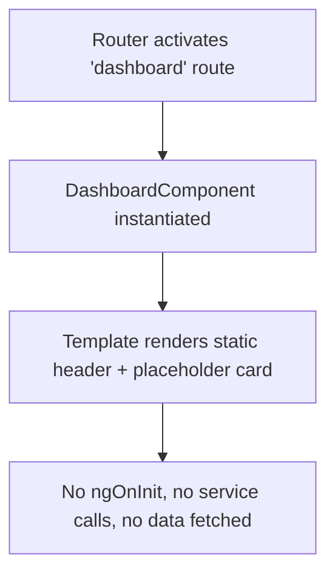

### Summary for the new developer

The Dashboard feature is a minimal, static "coming soon" placeholder page. If you are asked to build out real dashboard functionality (widgets, charts, KPIs), you will be starting from scratch: there is no existing service, model, or state pattern in this folder to extend — you'll need to add a service (likely following patterns used in other features such as `chart-of-accounts` or `user-management`), define models for whatever metrics are needed, and implement `ngOnInit` (or a signal/resource-based loading pattern) to fetch and render that data.

---

## 5. User Management

### 5.1 Overview & Navigation

The User Management module is an Angular 22 standalone-component feature area that lets administrators manage platform users, define roles/permissions, and audit user activity. It lives at `src/app/features/user-management/`.

**Top-level routing.** The module is lazy-loaded from the root router. In `src/app/app.routes.ts`, the `user-management` segment is mounted under the authenticated `MainLayoutComponent` shell (guarded by `authGuard`) and is itself gated by:

```ts
{
  path: 'user-management',
  canActivate: [permissionGuard('user_management')],
  loadChildren: () => import('./features/user-management/user-management.routes').then(m => m.userManagementRoutes),
}
```

So a user must hold the `user_management` module permission to enter any route under `/user-management/*`. The default app redirect (`{ path: '', redirectTo: 'user-management/users', pathMatch: 'full' }`) also means `/user-management/users` is effectively the landing page after login for users without a more specific default.

**Module-internal routing** — `src/app/features/user-management/user-management.routes.ts`:

| Path (relative to `/user-management`) | Full route | Loaded component |
|---|---|---|
| `''` | `/user-management` | redirects to `users` (`pathMatch: 'full'`) |
| `users` | `/user-management/users` | `UsersComponent` (`users/users.component.ts`) |
| `roles` | `/user-management/roles` | `RolesComponent` (`roles/roles.component.ts`) |
| `roles/create` | `/user-management/roles/create` | `RoleFormComponent` (`roles/role-form/role-form.component.ts`) |
| `roles/edit/:id` | `/user-management/roles/edit/:id` | `RoleFormComponent` (same component, edit mode via `:id` param) |
| `activity-logs` | `/user-management/activity-logs` | `ActivityLogsComponent` (`activity-logs/activity-logs.component.ts`) |

All five routes use `loadComponent` (standalone component lazy-loading, no separate feature module/NgModule).

**Component hierarchy.**

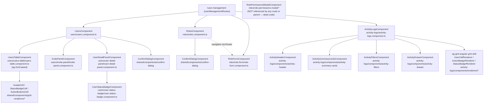

Note: `RolePermissionsModalComponent` (`roles/role-permissions-modal/role-permissions-modal.component.ts`) exists in the tree but is not imported by `RolesComponent`, `RoleFormComponent`, or any routed component (confirmed by searching the whole module for `RolePermissionsModalComponent` / `app-role-permissions-modal` — the only hits are the component's own file and its `.spec.ts`). Role create/edit in the live UI is handled entirely by the full-page `RoleFormComponent` via the `roles/create` and `roles/edit/:id` routes. Treat the modal as unused legacy code unless a future PR wires it in.

Services shared across the whole module live in `src/app/features/user-management/services/`: `UsersApi` (`users-api.ts`), `RolesApi` (`roles-api.ts`), `PermissionsApi` (`permissions-api.ts`). Activity Logs has its own scoped service, `ActivityLogsApi` (`activity-logs/services/activity-logs-api.ts`). All HTTP calls are built on `environment.apiUrl` (currently `http://localhost:3000/api`).

Models: `models/user.model.ts` (`User`, `UserType`, `UserStatus`, `PanelMode`, `UserDetailTab`, `PaginatedResult<T>`, `UsersFilter`, `InviteUserPayload`, `PendingInvite`, `UserStats`), `models/role.model.ts` (`Role`, `RoleDetail`, `CreateRolePayload`), `models/permission.model.ts` (`Permission`, `Module`, `MODULES`, `PermissionActionKey`, `PERMISSION_ACTION_LABELS`, `PERMISSION_ACTIONS`), and `activity-logs/models/activity-log.model.ts` (`ActivityLog`, `FieldChange`, `ActivityLogsFilter`).

---

### 5.2 Users List (`UsersComponent`)

File: `users/users.component.ts` / `users/users.component.html`. Standalone component, imports `FormsModule`, `UsersTableComponent`, `InvitePanelComponent`, `UserDetailPanelComponent`, `ConfirmDialogComponent`.

**State fields**: `users: User[]`, `roles: Role[]`, `pendingInvites: PendingInvite[]`, `stats: UserStats | null`, `loading`, `searchTerm`, `roleFilter`, `statusFilter`, `selectedIds: string[]`, `currentPage`/`perPage`/`total`/`totalPages`, `invitePanelOpen`, `detailPanelOpen`, `selectedUser`, `detailMode: PanelMode`, `confirmOpen`/`confirmTitle`/`confirmMessage`/`pendingAction`, `viewDropdownOpen`.

`ngOnInit()` calls `loadStats()`, `loadUsers()`, `loadRoles()`, `loadPendingInvites()`, and subscribes to `this.searchDebouncer.value$` (built via the shared `createDebouncedSearch<string>(300)` util from `src/app/shared/utils/debounced-search.util.ts`, which wraps an RxJS `Subject` piped through `debounceTime(300)` + `distinctUntilChanged()`) to reset `currentPage = 1` and re-call `loadUsers()`.

**Toolbar (in `users.component.html`, `.table-top-toolbar`):**

| Element | Binding | Handler | Behavior |
|---|---|---|---|
| "View" dropdown (role filter, styled as a people icon + label) | `(click)="viewDropdownOpen = !viewDropdownOpen"` on `.view-dropdown`; items `(click)="selectView(role.id)"` / `(click)="selectView('')"` | `selectView(roleId)` | Sets `roleFilter = roleId`, closes dropdown, calls `onFilterChange()` → resets `currentPage = 1`, calls `loadUsers()`. `currentViewName` getter shows `"All Users"` or the matched role's `label`. Dropdown auto-closes via `@HostListener('document:click')` → `onDocumentClick()` when a click lands outside `.view-dropdown-wrapper`. |
| Search input | `[(ngModel)]="searchTerm"` + `(ngModelChange)="onSearch($event)"` | `onSearch(term)` → `this.searchDebouncer.next(term)` | Debounced (300 ms via shared util); once it fires, `ngOnInit`'s subscription resets page to 1 and calls `loadUsers()`. |
| Status filter `<select>` | `[(ngModel)]="statusFilter"` + `(ngModelChange)="onFilterChange()"` | `onFilterChange()` | Options: `""` (All Statuses), `active`, `inactive`, `pending`. Resets `currentPage = 1`, calls `loadUsers()`. |
| "Add User" button (`.btn-add-user`, shown only if `hasPermission('user.create')`) | `(click)="invitePanelOpen = true"` | — | Opens `InvitePanelComponent` slide-over (`[open]="invitePanelOpen"`). |
| "Export" button (`.btn-import-export`, shown only if `hasPermission('activity_log.export')`) | `(click)="exportToExcel()"` | `exportToExcel()` | Builds CSV in-browser from the **currently loaded page** of `this.users` (headers `Name, Email, Role, Status`), calls private `downloadCSV(headers, rows, 'users.csv')`, which builds a `Blob` (`text/csv;charset=utf-8;`), creates an `<a>` with `URL.createObjectURL`, programmatically clicks it, and removes it. No API call — purely client-side, and only exports the page currently in memory, not the full filtered result set. |

`loadUsers()`: sets `loading = true`, calls `UsersApi.getUsers({ page, per_page, search, role_id, status })` → `GET {apiUrl}/users`. On success: `this.users = result.data`, `total = result.total`, `totalPages = result.total_pages`, `currentPage = result.page`, `loading = false`, `this.cdr.markForCheck()`. On error: `loading = false`, `toast.error('Failed to load users')`, `cdr.markForCheck()`.

`loadStats()` → `UsersApi.getStats()` → `GET {apiUrl}/users/stats`; populates the 4 stat cards (Total Users, Active Users, Roles Defined, Pending Invites).

`loadRoles()` → `RolesApi.getRoles({ per_page: 100 })` → `GET {apiUrl}/roles?per_page=100`; populates `roles` (used by the view dropdown, role badges, and passed as `[roles]` into `InvitePanelComponent`/`UserDetailPanelComponent`).

`loadPendingInvites()` → `UsersApi.getPendingInvites()` → `GET {apiUrl}/invites/pending`; populates the "Pending Invitations" table rendered below the main grid when `pendingInvites.length > 0`.

**Pagination**: rendered only `@if (totalPages > 1)`. Prev/Next buttons call `goToPage(currentPage - 1 / + 1)`; numbered buttons from `pageNumbers` getter (a sliding window of up to 5 pages: `currentPage - 2` to `currentPage + 2`, clamped to `[1, totalPages]`) call `goToPage(p)`. `goToPage(page)` guards `page < 1 || page > totalPages` (no-op), else sets `currentPage = page` and calls `loadUsers()`.

**Users table** — `<app-users-table [users]="users" [loading]="loading" (viewUser)="onViewUser($event)" (editUser)="onEditUser($event)" (deactivateUser)="onDeactivateUser($event)" (selectionChanged)="onSelectionChanged($event)" />`. `UsersTableComponent` wraps `ag-grid-angular`. Column defs (`setupColumns()`): optional checkbox column, `USER` (`AvatarCell`), `ROLE` (inline HTML with `role.color`), `DEPARTMENT`/`TITLE` (plain, `'-'` fallback), `STATUS` (`StatusBadgeCell`), `LAST LOGIN` (`formatDate()`, `'Never'` fallback), `ACTIONS` (`ActionButtonsCell` — View always, Edit/Deactivate gated by `hasPermission('user.edit')`, Deactivate suppressed for inactive rows or the super-admin). While `loading`, a 5-row CSS skeleton table renders instead of the grid.

**View/Edit a user**: `onViewUser(user)`/`onEditUser(user)` open `UserDetailPanelComponent`, a slide-over with two tabs (`Profile`, `Permissions` — the latter gated by `hasPermission('permission.assign')`):
- **Profile tab**: View mode shows read-only fields; Edit mode shows editable Name/Department/Title plus an Account Status toggle (local-only until save). `saveProfile()` calls `UsersApi.updateUser(user.id, payload)` → `PATCH {apiUrl}/users/:id`; on success emits `updated` (parent patches the row in place + `loadStats()`).
- **Permissions tab**: `loadPermissionsTab()` calls `PermissionsApi.getPermissions()` → `GET {apiUrl}/permissions` then `UsersApi.getUserPermissions(id)` → `GET {apiUrl}/users/:id/permissions`; grouped into 4 hard-coded top-level groups (Dashboard, Advanced Accounting, MGA Operations, System Admin) with nested accordions. `savePermissions()` → `UsersApi.updateUserPermissions(id, ids)` → `PUT {apiUrl}/users/:id/permissions`.

**Deactivate a single user**: `onDeactivateUser(user)` opens the shared `ConfirmDialogComponent` via a `pendingAction` closure; on confirm, calls `UsersApi.deactivateUser(user.id)` → `POST {apiUrl}/users/:id/deactivate`, then `loadUsers()` + `loadStats()`.

**Bulk deactivate**: `onSelectionChanged`/`openBulkDeactivate`/`clearSelection` are fully implemented (→ `UsersApi.deactivateBulk(ids)` → `POST {apiUrl}/users/deactivate-bulk`), **but `users.component.html` contains no button or control that calls `openBulkDeactivate()` or `clearSelection()`** — the checkbox column and selection tracking work, but there is currently no visible UI affordance to trigger bulk deactivate. This is dead/unreachable code pending a future toolbar addition.

**Invite User** — `InvitePanelComponent`, a reactive-form slide-over (`email`, `name`, `role_id`, `user_type`, `department`, `title`). `onSubmit()` → `UsersApi.inviteUser(payload)` → `POST {apiUrl}/users/invite`; on success emits `invited` (parent calls `loadUsers()`/`loadPendingInvites()`/`loadStats()`).

**Pending Invitations table**: "Revoke" button → `onRevokeInvite(id)` → `UsersApi.revokeInvite(id)` → `DELETE {apiUrl}/invites/:id`.

**Deactivate a single user — sequence diagram:**

```mermaid
sequenceDiagram
    actor U as User (admin)
    participant Tbl as UsersTableComponent
    participant UC as UsersComponent
    participant CD as ConfirmDialogComponent
    participant API as UsersApi
    participant Srv as Backend<br/>POST /api/users/:id/deactivate
    participant T as ToastService

    U->>Tbl: Click "Deactivate" action button on row
    Tbl->>UC: deactivateUser.emit(user)
    UC->>UC: onDeactivateUser(user)<br/>set confirmTitle/confirmMessage<br/>pendingAction = () => call API
    UC->>CD: confirmOpen = true (via [open] binding)
    CD-->>U: Render "Deactivate User" dialog
    U->>CD: Click "Deactivate" (confirm button)
    CD->>UC: confirmed.emit()
    UC->>UC: onConfirmed(): confirmOpen = false; pendingAction()
    UC->>API: deactivateUser(user.id)
    API->>Srv: POST {apiUrl}/users/:id/deactivate
    Srv-->>API: 200 { message }
    API-->>UC: next: () => ...
    UC->>T: toast.success("{name} has been deactivated")
    UC->>API: loadUsers() -> GET {apiUrl}/users
    UC->>API: loadStats() -> GET {apiUrl}/users/stats
    API-->>UC: refreshed users[] / stats
    UC-->>Tbl: [users]="users" updated -> grid re-renders
```

---

### 5.3 Roles Module

**`RolesComponent`** shows a card grid of roles. `ngOnInit()` calls `loadRoles()` → `RolesApi.getRoles({ page, per_page: 20 })` → `GET {apiUrl}/roles`. Each card shows color dot, `label`, "System" badge (`is_system`), `description`, `user_count`. "Edit Permissions" → `openEditModal(role)` → navigates to `/user-management/roles/edit/:id` (a routed page, not a modal, despite the button label). "+ New Role" → `openCreateModal()` → navigates to `/user-management/roles/create`. Delete (non-system roles only) → `onDeleteRole(role)` → confirm dialog → `RolesApi.deleteRole(id)` → `DELETE {apiUrl}/roles/:id`.

**`RoleFormComponent`** — one page for both create (`roles/create`) and edit (`roles/edit/:id`). `ngOnInit()` reads `roleId` from the route param; if present, `isEditMode = true` and it loads `RolesApi.getRole(id)` → `GET {apiUrl}/roles/:id`, disabling the `name` control if `is_system`. Always loads `PermissionsApi.getPermissions()` → `GET {apiUrl}/permissions`.

Form fields: `name` (required, pattern `/^[a-z0-9_]+$/`), `label` (required), `color` (default `#e05470`), `description` (optional). Permission assignment UI mirrors `UserDetailPanelComponent`'s accordion (search box, Select All/Expand All/Collapse All, per-module/sub-module select-all, `selectedIds: Set<string>`). `isFormValid` requires `form.valid && selectedIds.size > 0`. `onSave()` builds `CreateRolePayload` and dispatches `RolesApi.updateRole()` (`PATCH {apiUrl}/roles/:id`) or `RolesApi.createRole()` (`POST {apiUrl}/roles`).

**`RolePermissionsModalComponent`** implements an equivalent create/edit form as a modal but, as noted in 5.1, is **not wired into any route or parent component** — orphaned/unused code.

---

### 5.4 Activity Logs

**`ActivityLogsComponent`** composes:
- `ActivityHeaderComponent` — title + "Export Logs" button (`export` output → `exportLogs()`).
- `ActivitySummaryCardsComponent` — 5 stat cards (Total, Successful [+success-rate], Failed, Critical, Active Users Today).
- `ActivityFiltersComponent` — free-text search, Action `<select>`, Module `<select>` (from `PermissionsApi.getModules()`), From/To date range; every field's `(ngModelChange)` immediately emits `filterChange`.
- The main ag-Grid (columns: USER via `UserCellRenderer`, ACTION via `ActionBadgeRenderer`, MODULE via `formatModule()`, ENTITY, DESCRIPTION, IP ADDRESS, DEVICE/BROWSER, LOCATION, DATE & TIME, STATUS via `StatusBadgeRenderer`); clicking a row calls `openDrawer(event.data)`.
- `ActivityDrawerComponent` — full detail view (Overview, Field Changes, Technical Metadata).

**Data loading**: `loadLogs()` → `ActivityLogsApi.getLogs({...filter})` → `GET {apiUrl}/activity-logs`. Each returned log is piped through `injectMockData(log)`, which **randomly fabricates** `ip_address`/`status`/`device`/`browser`/`location`/`os`/`session_id`/`correlation_id` whenever the backend value is missing — explicitly commented in the source as mock UI data. `loadStats()` → `GET {apiUrl}/activity-logs/stats`. `loadModules()` → `GET {apiUrl}/permissions/modules`.

**Filtering/pagination**: `onFilterChange()` resets to page 1 and reloads (server-side). Pagination mirrors the Users/Roles sliding-5-page pattern via `goToPage(page)`.

**Export**: `exportLogs()` → `GET {apiUrl}/activity-logs/export` with `responseType: 'blob'` (server-generates the CSV, unlike Users' client-side export) — downloads as `activity-logs-{date}.csv`.

*(Full endpoint-by-endpoint detail for Activity Logs is repeated with additional context in [Chapter 10](#10-activity-logs), which is dedicated to this sub-feature per the requested document outline.)*

---

### API Endpoint Reference (all endpoints called anywhere in this module)

Base URL for all rows below is `environment.apiUrl`.

| Method | Path | Service.method | Triggered by |
|---|---|---|---|
| GET | `/users` | `UsersApi.getUsers()` | `UsersComponent.loadUsers()` — initial load, search (debounced), status/role filter change, pagination |
| GET | `/users/:id` | `UsersApi.getUser()` | Defined on the service; not called from any component in this module currently |
| POST | `/users/invite` | `UsersApi.inviteUser()` | `InvitePanelComponent.onSubmit()` |
| PATCH | `/users/:id` | `UsersApi.updateUser()` | `UserDetailPanelComponent.saveProfile()` |
| POST | `/users/:id/deactivate` | `UsersApi.deactivateUser()` | `UsersComponent.onDeactivateUser()` |
| POST | `/users/deactivate-bulk` | `UsersApi.deactivateBulk()` | `UsersComponent.openBulkDeactivate()` — defined but **not wired to any template control** (dead code) |
| GET | `/users/:id/permissions` | `UsersApi.getUserPermissions()` | `UserDetailPanelComponent.loadPermissionsTab()` |
| PUT | `/users/:id/permissions` | `UsersApi.updateUserPermissions()` | `UserDetailPanelComponent.savePermissions()` |
| GET | `/invites/pending` | `UsersApi.getPendingInvites()` | `UsersComponent.loadPendingInvites()` |
| DELETE | `/invites/:id` | `UsersApi.revokeInvite()` | `UsersComponent.onRevokeInvite()` |
| GET | `/users/stats` | `UsersApi.getStats()` | `UsersComponent.loadStats()` |
| GET | `/roles` | `RolesApi.getRoles()` | `UsersComponent.loadRoles()`, `RolesComponent.loadRoles()` |
| GET | `/roles/:id` | `RolesApi.getRole()` | `RoleFormComponent.loadData()` (edit mode) |
| POST | `/roles` | `RolesApi.createRole()` | `RoleFormComponent.onSave()` (create) |
| PATCH | `/roles/:id` | `RolesApi.updateRole()` | `RoleFormComponent.onSave()` (edit) |
| DELETE | `/roles/:id` | `RolesApi.deleteRole()` | `RolesComponent.onDeleteConfirmed()` |
| GET | `/permissions/modules` | `PermissionsApi.getModules()` | `ActivityLogsComponent.loadModules()` |
| GET | `/permissions` | `PermissionsApi.getPermissions()` | `UserDetailPanelComponent.loadPermissionsTab()`, `RoleFormComponent.loadData()` |
| GET | `/activity-logs` | `ActivityLogsApi.getLogs()` | `ActivityLogsComponent.loadLogs()` |
| GET | `/activity-logs/export` | `ActivityLogsApi.exportLogs()` | `ActivityLogsComponent.exportLogs()` |
| GET | `/activity-logs/stats` | `ActivityLogsApi.getStats()` | `ActivityLogsComponent.loadStats()` |

The whole `user-management` subtree is additionally guarded, in `src/app/app.routes.ts`, by `canActivate: [permissionGuard('user_management')]`.

---

## 6. Masters Module

### 6.1 The Masters page shell and tab-switching mechanism

The Masters feature lives entirely under `src/app/features/masters/`. The route `/masters` is guarded by `permissionGuard('master_data')` and renders `MastersComponent` (`src/app/features/masters/masters.component.ts`), a single-page tab container — there is no child routing; all 14 "tabs" are shown/hidden inside one component via an Angular `@switch` block, and the active tab is driven entirely by a `tab` query parameter (not the URL path).

**State and sync:**

```ts
// src/app/features/masters/masters.component.ts
currentTab: MasterTab = MasterTab.Treaties;

ngOnInit(): void {
  this.route.queryParams.subscribe(params => this.syncTabFromUrl(params));
}

private syncTabFromUrl(params: Params): void {
  const tab = params['tab'] as MasterTab;
  this.currentTab = tab && Object.values(MasterTab).includes(tab) ? tab : MasterTab.Treaties;
  this.cdr.markForCheck();
}

selectTab(tab: MasterTab): void {
  this.router.navigate([], {
    relativeTo: this.route,
    queryParams: { tab },
    queryParamsHandling: 'merge',
  });
}
```

So clicking a tab calls `selectTab(tab)`, which navigates to `/masters?tab=<value>` (merging with any existing query params). The `queryParams` subscription in `ngOnInit` fires `syncTabFromUrl`, which validates the incoming `tab` value against the `MasterTab` enum (`src/app/features/masters/models/master-tab.model.ts`) and falls back to `MasterTab.Treaties` if invalid/missing. `MastersComponent` then re-renders the `@switch (currentTab)` block in `masters.component.html`. Because state lives in the query param, tabs are deep-linkable/bookmarkable and browser back/forward works naturally.

The page header's "Add" button is also tab-conditional, calling into whichever child tab component is active via `@ViewChild` references (`mgasTab`, `statesTab`, `riskCompaniesTab`, `glMappingsTab`, `lockedPeriodsTab`, `simpleMasterTab`).

**Full 14-tab mapping** (enum values from `master-tab.model.ts`, rendering from `masters.component.html`):

| `MasterTab` enum value | Query param (`tab=`) | Rendering component | Notes |
|---|---|---|---|
| `Treaties` | `treaties` | `TreatiesTab` (`components/treaties-tab/`) | Dedicated component — see §6.8 |
| `Mgas` | `mgas` | `MgasTab` (`components/mgas-tab/`) | Dedicated — see Chapter 7 (deep dive) |
| `Lobs` | `lobs` | `SimpleMasterTab` with `[mode]="SimpleMode.Lob"` | **Simple entity** |
| `Cobs` | `cobs` | `SimpleMasterTab` with `[mode]="SimpleMode.Cob"` | **Simple entity** |
| `States` | `states` | `StatesTab` (`components/states-tab/`) | Dedicated — see §6.8 |
| `Reinsurers` | `reinsurers` | `SimpleMasterTab` with `[mode]="SimpleMode.Reinsurer"` | **Simple entity** |
| `RiskCompanies` | `risk-companies` | `RiskCompaniesTab` (`components/risk-companies-tab/`) | Dedicated — see §6.8 |
| `GlMappings` | `gl-mappings` | `GlMappingsTab` (`components/gl-mappings-tab/`) | Dedicated — see §6.8 |
| `Brokers` | `brokers` | `SimpleMasterTab` with `[mode]="SimpleMode.Broker"` | **Simple entity** |
| `Products` | `products` | `SimpleMasterTab` with `[mode]="SimpleMode.Product"` | **Simple entity** (LOB/COB multi-select) |
| `LockedPeriods` | `locked-periods` | `LockedPeriodsTab` (`components/locked-periods-tab/`) | Dedicated — see §6.8 |
| `DocumentTypes` | `document-types` | `SimpleMasterTab` with `[mode]="SimpleMode.DocumentType"` | **Simple entity** |
| `SequencePrefixCounters` | `sequence-prefix-counters` | `SimpleMasterTab` with `[mode]="SimpleMode.SequencePrefixCounter"` | **Simple entity** |
| `TreatyTypes` | `treaty-types` | `SimpleMasterTab` with `[mode]="SimpleMode.TreatyType"` | **Simple entity** |

8 of the 14 tabs (Lobs, Cobs, Reinsurers, Brokers, Products, DocumentTypes, SequencePrefixCounters, TreatyTypes) are handled by one reusable component, `SimpleMasterTab`. The other 6 (Treaties, Mgas, States, RiskCompanies, GlMappings, LockedPeriods) each have their own dedicated tab component, detailed in §6.8 and Chapter 7.

---

### 6.2 `SimpleMasterTab` — the generic component behind 8 entity types

File: `src/app/features/masters/components/simple-master-tab/simple-master-tab.ts` (+ `.html`, `.export.ts`, `.spec.ts`).

**Config-driving mechanism.** `SimpleMasterTab` takes a single required `@Input() mode!: SimpleMode`, where `SimpleMode` is an enum in `src/app/features/masters/models/simple-form.model.ts`:

```ts
export enum SimpleMode {
  Lob = 'lob',
  Cob = 'cob',
  Reinsurer = 'reinsurer',
  Broker = 'broker',
  Product = 'product',
  DocumentType = 'document-type',
  SequencePrefixCounter = 'sequence-prefix-counter',
  TreatyType = 'treaty-type',
}
```

Every mode-specific behavior (label, API calls, columns, form fields) is resolved by switching on this single value, rather than by separate Inputs — there is no separate "config object" Input; the "config" is really a set of lookup tables and switch statements keyed by `SimpleMode`, spread across a few collaborator files:

- **Add-button label** — `ADD_LABELS: Record<SimpleMode, string>` inside `simple-master-tab.ts` (e.g. `'LOB'`, `'COB'`, `'Reinsurer'`, `'Broker'`, `'Product'`, `'Document Type'`, `'Sequence Counter'`, `'Treaty Type'`), exposed via the `addLabel` getter.
- **Human label for toasts/titles** — `MASTER_LABELS: Record<SimpleMode, string>` inside `src/app/features/masters/services/simple-masters-state.ts` (e.g. `'Line of Business'`, `'Class of Business'`, `'Reinsurer Company'`, `'Broker'`, `'Product'`, `'Document Type'`, `'Sequence Prefix & Counter'`, `'Treaty Type'`), via `SimpleMastersState.getMasterLabel(mode)`.
- **API service selection** — `SimpleMastersState` (`src/app/features/masters/services/simple-masters-state.ts`) injects all 8 API services (`LobsApi`, `CobsApi`, `ReinsurersApi`, `BrokersApi`, `ProductsApi`, `DocumentTypesApi`, `SequencePrefixCountersApi`, `TreatyTypesApi`) and switches on `mode` in `load()`, `create()` (private), `update()` (private), and `delete()` to call the right one. It also owns 8 local arrays (`lobs`, `cobs`, `reinsurers`, `brokers`, `products`, `documentTypes`, `sequencePrefixCounters`, `treatyTypes`) as an in-memory cache, exposed via `getList(mode)`.
- **Payload shaping per mode** — `SimpleMastersState.save()` builds a mode-specific `payload` object from the generic `SimpleFormValue`, keyed by a `CODE_KEYS: Record<SimpleMode, string>` map (e.g. Lob → `lob_code`, Cob → `cob_code`, Reinsurer → `reinsurer_company_id`, Broker/DocumentType/SequencePrefixCounter → `code`, Product → `product_id`, TreatyType → `type_code`), then adds extra fields conditionally (e.g. Cob gets `type`, `taxable`, `priority`, `fully_earned`, `asl_code`; Broker gets `contact_name/email/phone`; Product gets `lob_id`/`cob_id`; SequencePrefixCounter gets `prefix`/`next_value`/`padding_width`).
- **Grid columns** — one `build*ColumnDefs(ctx, statusCol)` function per entity in `src/app/features/masters/grid-columns/` (`lobs-columns.ts`, `cobs-columns.ts`, `reinsurers-columns.ts`, `brokers-columns.ts`, `products-columns.ts`, `document-types-columns.ts`, `sequence-prefix-counters-columns.ts`, `treaty-types-columns.ts`), selected via a `switch (this.mode)` in the `currentColumnDefs` getter on `SimpleMasterTab`.
- **Export (CSV) shape** — `buildSimpleTabExportData(mode, state)` in `simple-master-tab.export.ts`, switching on mode to produce different header/row sets (note: Broker and TreatyType currently fall through to the `default: { headers: [], rows: [], filename: '' }` case — the export function has explicit cases only for Lob, Cob, Reinsurer, DocumentType, SequencePrefixCounter).
- **Form fields shown/hidden** — inside `simple-form-modal.html`, via `@if (mode === SimpleMode.X)` blocks.

**Add/Edit/View/Delete flow (all generic, on `SimpleMasterTab`):**

- `openSimpleAdd()` — resets `isEditMode=false`, `isViewMode=false`, sets `modalTitle` to `Add New {label}`, resets `form` to `createBlankSimpleForm()`, opens the modal (`showModal = true`).
- `openSimpleEdit(mode, item)` — sets `isEditMode=true`, `isViewMode=false`, maps the row's raw fields onto the generic `SimpleFormValue` shape (handling several possible source field names per entity, e.g. `code ?? lob_code ?? cob_code ?? reinsurer_company_id ?? product_id`, and for Product converts comma-joined `lob_id`/`cob_id` strings into arrays for the multi-select), then opens the modal.
- `openSimpleView(mode, item)` — identical field mapping to Edit, but sets `isViewMode = true` (no editing).
- `submitSimple(formValue)` — client-side guard requiring `code` and `name` (`toast.error('Code and Name are required')` otherwise), then calls `SimpleMastersState.save(mode, isEditMode, form)`. On success: success toast, `showModal = false`, and `this.load()` to refresh the grid. On error: `HttpErrorLike` message is toasted (falls back to `'Failed to save master data'`).
- `deleteSimple(mode, item)` — does **not** call the API directly; it opens the shared `ConfirmDialogComponent` (title `Delete {label}`, message referencing `item.name`) and stashes a `pendingAction` closure. `onConfirm()` (bound to the dialog's `(confirmed)`) invokes the closure, which calls `SimpleMastersState.delete(mode, item.id)` and, on success, toasts and reloads.

**Generic patch-and-disable pattern (`SimpleFormModal`).** File: `src/app/features/masters/components/simple-form-modal/simple-form-modal.ts`. It owns one shared Reactive Form built by `SimpleForm.createForm()` (`src/app/features/masters/forms/simple-form.ts`), with 18 controls covering the union of all 8 entities' fields (`id, code, name, is_active, description, type, taxable, priority, fully_earned, asl_code, contact_name, contact_email, contact_phone, lob_id, cob_id, prefix, next_value, padding_width`). Reacting to `@Input() model` changes via `ngOnChanges`:

```ts
ngOnChanges(changes: SimpleChanges): void {
  if (changes['model']) {
    this.simpleFormService.patchForm(this.form, this.model);   // form.patchValue(value)
    this.syncFormToDicts();
  }
  if (changes['mode'] || changes['isEditMode']) {
    if (this.isEditMode) { this.form.controls.code.disable(); }
    else { this.form.controls.code.enable(); }
    this.form.controls.name.enable();
  }
  if (changes['isViewMode']) {
    if (this.isViewMode) {
      this.form.disable();                 // disable-for-view pattern
    } else {
      this.form.enable();
      if (this.isEditMode) this.form.controls.code.disable();
    }
  }
}
```

So: the `code` field is always disabled in edit mode (immutable primary key), and in view mode the **entire `FormGroup` is disabled** (`this.form.disable()`), which greys out every control and makes the footer render a single "Close" button instead of Cancel/Save ("Cancel / Save Entry" in `simple-form-modal.html`). On submit, `SimpleForm.toFormValue(form)` calls `form.getRawValue()` (so disabled controls' values are still included) and normalizes `id: raw.id ?? undefined`.

For Product's LOB/COB multi-select, the modal keeps a parallel `selectedLobsDict`/`selectedCobsDict` (`{[id]: boolean}`) synced from/to the form's `lob_id`/`cob_id` arrays via `syncFormToDicts()`, `onLobsDictChange()`, `onCobsDictChange()`, feeding the shared `app-dropdown-search` component (`isMultiSelect="true"`).

**Search / filter / pagination — server-side filtering, client-side pagination.** `SimpleMasterTab` keeps `searchTerm` (string) and `statusFilter` (`ActiveStatusFilter.All | Active | Inactive`) bound via `[(ngModel)]` in `simple-master-tab.html`, with `(ngModelChange)="onFilterChange()"` on both the search input and the status `<select>`. `onFilterChange()` simply calls `load()` again, which re-invokes `SimpleMastersState.load(this.mode, this.searchTerm || undefined, this.activeFilterStatus)` — i.e. **every keystroke or filter change re-issues an HTTP GET** with `search` and `is_active` query params. There is no debounce in `SimpleMasterTab` itself (unlike the Users search box in Chapter 5, which uses `createDebouncedSearch`). Pagination, by contrast, is entirely **client-side**: the full filtered array returned by the API is passed as `rowData` to `MastersGrid`/ag-Grid, and ag-Grid's default (client-side) row model paginates it in the browser using `AgGridConfigService.getDefaultGridOptions()` (`pagination: true`, `paginationPageSize: 10`, `paginationPageSizeSelector: [10, 25, 50, 100]`) — no page/limit params are ever sent to the backend.

---

### 6.3 `MastersGrid` — shared ag-Grid wrapper

File: `src/app/features/masters/components/masters-grid/masters-grid.ts` (+ `.html`, `.scss`). This is a thin, purely presentational wrapper around `ag-grid-angular`, used by **every** Masters tab (both the 8 simple entities and the 6 dedicated tabs).

**Inputs** (no Outputs — it does not emit events; row actions are wired through ag-Grid cell renderers configured by the caller):

| Input | Type | Purpose |
|---|---|---|
| `loading` | `boolean` | Shows a spinner + "Loading master data..." empty-state instead of the grid |
| `rowData` | `unknown[]` | The (already filtered) records to display |
| `columnDefs` | `ColDef[]` | Column definitions, built by the caller (e.g. `SimpleMasterTab.currentColumnDefs`) |
| `gridOptions` | `GridOptions` (required) | Passed straight to `ag-grid-angular`; callers typically get this from `AgGridConfigService.getDefaultGridOptions()` |

**Responsibilities**: it renders one of three states — loading spinner, an empty-state message ("No records found. Try adjusting your filters or create a new entry.") when `rowData.length === 0`, or the actual `<ag-grid-angular>` instance (`domLayout: 'autoHeight'`, class `ag-theme-alpine masters-grid-instance`). It does not own column defs, pagination config, or row actions itself — those all come from the injected `gridOptions`/`columnDefs`. Row-level Edit/View/Delete buttons are rendered by `ActionButtonsCell` (`src/app/shared/components/grid-renderers/action-buttons-cell/action-buttons-cell.ts`), whose `cellRendererParams.onClick(action, data)` callback is supplied per-entity in each `grid-columns/*.ts` file (calling back into `ctx.openSimpleEdit/openSimpleView/deleteSimple`).

---

### 6.4 `DocumentDrawer` — shared document upload/list drawer

File: `src/app/features/masters/components/document-drawer/document-drawer.ts` (+ `.html`, `.scss`). Used by the Mgas, States, and RiskCompanies dedicated tabs (§6.8) to attach/list/download/delete files against a master record. `DocumentDrawer` itself is a **dumb presentational component** — it makes no HTTP calls; all API interaction is delegated to the parent tab component via `DocumentsDrawerState` (`src/app/features/masters/services/documents-drawer-state.ts`).

**Inputs:**

| Input | Type | Purpose |
|---|---|---|
| `open` | `boolean` | Show/hide the drawer overlay |
| `subtitle` | `string` | Text shown as "Attachments for: {subtitle}" |
| `documentsList` | `DrawerDocument[]` | Documents to render (`{ id, file_name, file_url, uploaded_at, document_type?/documentType? }`) |
| `documentTypesOptions` | `DocumentType[]` | Populates the "Document Type" `<select>` |
| `uploadingDoc` | `boolean` | Shows an inline spinner + "Uploading..." on the upload button |

**Outputs:**

| Output | Payload | Fired when |
|---|---|---|
| `closed` | `void` | Close button or backdrop click |
| `fileSelected` | `{ file: File; documentType: string }` | User picks a file |
| `download` | `DrawerDocument` | "Download" button clicked |
| `delete` | `DrawerDocument` | "Delete" button clicked |

**Upload/download/delete flow** (orchestrated by `DocumentsDrawerState`, keyed by `DocumentMode` enum — `Mga | State | RiskCompany`):
1. `loadDocumentTypes()` → `DocumentTypesApi.getDocumentTypes(undefined, true)` → `GET {apiUrl}/masters/document-types?is_active=true`.
2. `loadDocuments(mode, id)` → fetches the owning record itself (`MgasApi.getMga(id)`, `StatesApi.getState(id)`, or `RiskCompaniesApi.getRiskCompany(id)`) and reads its embedded `.documents` array — documents are **not** fetched via a dedicated list endpoint.
3. `upload(mode, itemId, file, documentType)` → dispatches to the matching `*Api.upload*Document`.
4. `delete(mode, docId)` → dispatches to the matching `*Api.delete*Document`.
5. `getDownloadEndpoint(mode)` returns the resource segment (`mgas` | `states` | `risk-companies`).

---

### 6.5 Simple-entity API services

All 8 services follow an identical shape: `HttpClient` injected, a `base` URL of `${environment.apiUrl}/masters/<resource>`, and 4 methods — `get*` (optional `search`/`isActive` query params), `create*` (POST), `update*` (PATCH by id), `delete*` (DELETE by id).

| Service | Base path | Methods |
|---|---|---|
| `LobsApi` (`services/lobs-api.ts`) | `masters/lobs` | `getLobs`, `createLob`, `updateLob`, `deleteLob` |
| `CobsApi` (`services/cobs-api.ts`) | `masters/cobs` | `getCobs`, `createCob`, `updateCob`, `deleteCob` |
| `ReinsurersApi` (`services/reinsurers-api.ts`) | `masters/reinsurers` | `getReinsurers`, `createReinsurer`, `updateReinsurer`, `deleteReinsurer` |
| `BrokersApi` (`services/brokers-api.ts`) | `masters/brokers` | `getBrokers`, `createBroker`, `updateBroker`, `deleteBroker` |
| `ProductsApi` (`services/products-api.ts`) | `masters/products` | `getProducts`, `createProduct`, `updateProduct`, `deleteProduct` |
| `DocumentTypesApi` (`services/document-types-api.ts`) | `masters/document-types` | `getDocumentTypes`, `createDocumentType`, `updateDocumentType`, `deleteDocumentType` |
| `SequencePrefixCountersApi` (`services/sequence-prefix-counters-api.ts`) | `masters/sequence-prefix-counters` | `getSequencePrefixCounters`, `createSequencePrefixCounter`, `updateSequencePrefixCounter`, `deleteSequencePrefixCounter` |
| `TreatyTypesApi` (`services/treaty-types-api.ts`) | `masters/treaty-types` | `getTreatyTypes`, `createTreatyType`, `updateTreatyType`, `deleteTreatyType` |

Each `get*` accepts `(search?, isActive?)` and issues `GET {base}?search=&is_active=`; `create*` issues `POST {base}`; `update*` issues `PATCH {base}/{id}`; `delete*` issues `DELETE {base}/{id}`. All 8 are orchestrated by `SimpleMastersState` — `SimpleMasterTab` never imports an entity-specific API service itself.

---

### 6.6 Shared utilities: `csv-export.util.ts` and `label-fns.util.ts`

**`downloadCsv(headers, rows, filename)`** — `src/app/features/masters/utils/csv-export.util.ts`. Pure client-side CSV export with no server call: builds a CSV string (quoting/escaping each cell, `\r\n` line endings), wraps it in a `Blob` (`text/csv;charset=utf-8;`), creates an `<a>` with an `URL.createObjectURL(blob)` href and a synthetic `.click()`, then cleans up.

**`label-fns.util.ts`** — small pure functions that turn a master record into a display string, used mainly by `app-dropdown-search` (`itemLabelFn`) in modals/filters:
- `mgaLabelFn(item)` → `"{name} ({mga_code})"`
- `riskCompanyLabelFn(item)` → `"{name} ({risk_company_id})"`
- `reinsurerLabelFn(item)` → `"{name} ({reinsurer_company_id})"`
- `stateLabelFn(item)` → `"{state_code} - {name}"`
- `stateAbbrLabelFn(item)` → `"{state_abbr} - {name}"` — the function currently open in the IDE at `masters/utils/label-fns.util.ts`
- `lobLabelFn(item)` → `"{name} ({lob_code})"`
- `cobLabelFn(item)` → `"{name} ({cob_code})"`
- `coaLabelFn(item)` → `"{account_code} - {description}"`
- `nameLabelFn(item)` → `item.name`
- `brokerLabelFn(item)` → `item.name ?? ''`

---

### 6.7 Diagrams

**Tab selection → generic simple-entity render:**

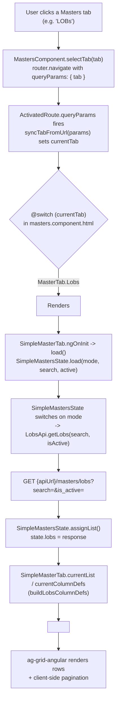

**Add a new generic simple-entity record (example: LOB) end-to-end:**

```mermaid
sequenceDiagram
    actor User
    participant Header as MastersComponent (header button)
    participant Tab as SimpleMasterTab
    participant Modal as SimpleFormModal
    participant State as SimpleMastersState
    participant Api as LobsApi
    participant Backend as Backend API
    participant Grid as MastersGrid (ag-Grid)

    User->>Header: Click "Add LOB"
    Header->>Tab: simpleMasterTab.openSimpleAdd()
    Tab->>Tab: isEditMode=false, isViewMode=false\nform = createBlankSimpleForm()\nshowModal = true
    Tab->>Modal: [open]=true [model]=form [isEditMode]=false [isViewMode]=false
    Modal->>Modal: ngOnChanges: patchForm(form, model)\nform.enable(); code.enable()
    User->>Modal: Fill Code, Name, Taxable, Priority, etc.\nClick "Save Entry"
    Modal->>Modal: submit(): if form.invalid -> markAllAsTouched & stop
    Modal->>Tab: save.emit(SimpleForm.toFormValue(form))
    Tab->>Tab: submitSimple(formValue)\nvalidate code & name present\nsubmitting = true
    Tab->>State: save(SimpleMode.Lob, isEditMode=false, formValue)
    State->>State: build payload keyed by CODE_KEYS[Lob]='lob_code'\n+ description, taxable, priority, fully_earned
    State->>Api: createLob(payload)
    Api->>Backend: POST {apiUrl}/masters/lobs
    Backend-->>Api: 201 Created (LineOfBusiness)
    Api-->>State: Observable<LineOfBusiness>
    State-->>Tab: success
    Tab->>Tab: toast.success("Line of Business saved successfully")\nshowModal=false; submitting=false
    Tab->>State: load(mode, searchTerm, activeFilterStatus)
    State->>Api: getLobs(search, isActive)
    Api->>Backend: GET {apiUrl}/masters/lobs?search=&is_active=
    Backend-->>Api: LineOfBusiness[]
    Api-->>State: assignList() updates state.lobs
    State-->>Tab: refreshed list
    Tab->>Grid: [rowData]=currentList (updated)
    Grid-->>User: New LOB row visible in grid
```

---

### 6.8 Dedicated tabs: Treaties, States, GL Mappings, Risk Companies, Locked Periods

The other 6 (of 14) Masters tabs each have their own dedicated component instead of going through `SimpleMasterTab`. MGAs is covered separately, in full depth, in [Chapter 7](#7-mga-module-deep-dive). All five entities below render through the same shared `MastersGrid` (§6.3), with the same client-side ag-Grid pagination described in §6.2.

#### Treaties

**Purpose / business meaning.** A `Treaty` (`features/masters/models/master.model.ts`) models a reinsurance program: it links an MGA (underwriter), one or more carrier "risk companies", one or more reinsurers, the writing states, and the lines/classes of business (LOB/COB) it is authorized for. It also carries the full economic terms of the program (Quota Share %, CF %, Commission %, BB %, ULAE %/flat amount, XOL %, LR Cap %, Loss Pick/IBNR %, LAE DCC/AOE %), policy/claim sequence-numbering configuration, and drives the ITD (Inception-To-Date) reserve workbook process used by Reinsurance Calculations (Chapter 8).

**Component / template.** `features/masters/components/treaties-tab/treaties-tab.ts` (class `TreatiesTab`), template `treaties-tab.html`.

**Search / filter / pagination.**
- Free-text search (`searchTerm`) and the Active/Inactive `statusFilter` are **server-side** — `onFilterChange()` → `load()` → `TreatiesState.load(searchTerm, activeFilterStatus)` → `TreatiesApi.getTreaties(search, isActive)` → `GET {apiUrl}/masters/treaties?search=...&is_active=...`.
- The **MGA dropdown filter** (`mgaFilter`) is **client-side only**: the `currentList` getter filters the already-loaded `treatiesState.treaties` array in memory by `t.mga_id === mgaFilter || t.treaty_mgas?.some(tm => tm.mga_id === mgaFilter)` — it does not trigger a reload.

**Create/Edit/View/Delete.**
- `openTreatyAdd(mgaId?)` — blank form via `buildBlankTreatyForm(mgaId)` (`treaty-selection.util.ts`).
- `openTreatyEdit(treaty)` / `openTreatyView(treaty)` — builds edit state via `buildTreatyEditState(treaty)`; `TreatyFormModal` disables the whole reactive form (`this.form.disable()`) in `ngOnChanges` when `isViewMode` is true (no separate read-only template).
- Submission: `TreatyFormModal.submit()` validates, emits a `TreatySaveEvent` (`{ form, selectedStates, selectedLobs, selectedCobs }`). `TreatiesTab.submitTreaty(event)` re-validates `treaty_code`/`name`/`mga_id`, builds the payload via `buildTreatyPayload(...)`, calls `TreatiesState.save(isEditMode, id, payload)` → `TreatiesApi.createTreaty()` (`POST {apiUrl}/masters/treaties`) or `updateTreaty()` (`PATCH {apiUrl}/masters/treaties/:id`).
- `deleteTreaty(treaty)` → confirm dialog → `TreatiesState.delete(id)` → `DELETE {apiUrl}/masters/treaties/:id`.

**Entity-specific logic.**
- **Nested form mapping** (`treaty-selection.util.ts`): `buildBlankTreatyForm`, `buildTreatyEditState` (reconstructs `carriers`/`reinsurers` arrays from `treaty.treaty_carriers`/`treaty.treaty_reinsurers` or legacy singular fields, converts dates to `yyyy-MM-dd`, builds `selectedStates`/`selectedLobs`/`selectedCobs` maps), `buildTreatyPayload` (converts selection maps back to arrays; **all** selected COBs are attached to **every** selected LOB — COBs are not tracked per-LOB in the UI).
- **Multi-carrier**: data model is array-shaped (`TreatyCarrier[]`), but the UI only renders a single carrier row in practice.
- **Multi-reinsurer**: fully implemented — `addReinsurerRow()`/`removeReinsurerRow(index)`, each row has `reinsurer_id`, optional `state_id`, optional `broker_id`+`broker_comm_type`, and `cession_pct`. `updateReinsurerCessionPct()` auto-redistributes the remaining % proportionally across other rows so the total always sums to 100.
- **Writing-states truncation** (`treaty-display.util.ts`): `getStatesListDisplay()` shows up to 4 state codes + `(+N more)` beyond 5.
- **ITD / Excel upload workflow** (delegated to `TreatyUploadsPanel`): monthly workbook upload and ITD baseline upload both call `ReinsuranceApi.uploadWorkbook()` (feature `reinsurance-calculations`); manual ITD entry calls `ReinsuranceApi.createManualITD()`.
- **Workbook-status badges**: `TreatiesState.load()` first calls `ReinsuranceApi.getWorkbooks()` to classify programs into `seededProgramITD`/`itdWorkbookIds`/`treatyWorkbookStatuses` before fetching the treaty list.

**`TreatiesState` public API** (`services/treaties-state.ts`): state = `treaties`, `seededProgramITD`, `itdWorkbookIds`, `treatyWorkbookStatuses`; methods `load(search?, active?)`, `save(isEditMode, id, payload)`, `delete(id)`, `hasITDSeeded(programName)`, `getTreatyStatus(programName?)`.

**Validation** (`forms/treaty-form.ts`): `treaty_code`, `name`, `mga_id` required; all economic/date fields unvalidated.

#### States

**Purpose.** `StateMaster` is the master list of US states/jurisdictions used everywhere else in the app (treaty writing states, MGA/risk-company addresses, reinsurer state-specific cessions) — `state_code` (numeric), `state_abbr` (2-letter), `name`, `notes`, `is_active`.

**Component.** `features/masters/components/states-tab/states-tab.ts` (`StatesTab`).

**Search/filter**: server-side, same pattern as Treaties — `StatesState.load(searchTerm, activeFilterStatus)` → `StatesApi.getStates()` → `GET {apiUrl}/masters/states?search=...&is_active=...`.

**Create/Edit/View/Delete**: `openStateAdd/Edit/View()`; identity fields (`state_code`/`state_abbr`) disabled in edit mode, whole form disabled in view mode. `submitState()` validates `state_code`/`state_abbr`/`name` present → `StatesState.save()` → `createState()` (`POST {apiUrl}/masters/states`) / `updateState()` (`PATCH {apiUrl}/masters/states/:id`). `deleteState()` → confirm → `DELETE {apiUrl}/masters/states/:id`.

**Entity-specific logic**: Notes viewer via shared `NotesModal`. Documents drawer (`DocumentMode.State`) — upload `POST {apiUrl}/masters/states/:id/documents`, download `GET {apiUrl}/masters/states/documents/download/:file_url` (via `window.open`), delete `DELETE {apiUrl}/masters/states/documents/:docId`.

**`StatesState` public API**: state = `states`; methods `load(search?, active?)`, `save(isEditMode, id, payload)`, `delete(id)`.

**Validation** (`forms/state-form.ts`): `state_code` required, `state_abbr` required + `maxLength(2)`, `name` required.

#### GL Mappings

**Purpose.** A `GlMapping` links a Chart-of-Accounts leaf account (`coa_id`) to one of four fixed system roles via `GlMappingType`: `AR`, `AP`, `MGA`, `BRK` — tells the accounting/posting engine which ledger account to use for each posting category.

**Component.** `features/masters/components/gl-mappings-tab/gl-mappings-tab.ts` (`GlMappingsTab`).

**Search/filter — entirely client-side.** Unlike every other tab, `GlMappingsApi.getMappings()` (`GET {apiUrl}/gl-mappings` — note: **not** under `/masters/...`) takes **no query params**, always returning the full list. `GlMappingsState.load(searchTerm?)` filters the in-memory array only if `searchTerm` is truthy, matching on `type`, the linked COA's `account_code`, or its `description` (case-insensitive substring). No status filter exists for this entity (no active/inactive concept).

**Create/Edit/View/Delete**: `openGlMappingAdd()` loads `loadCoaOptions()` (`ChartOfAccountsApi.getAccounts(undefined, true)`, filtered client-side to `!coa.is_parent` — only leaf accounts selectable). `submitGlMapping()` requires `coa_id`+`type` → `createMapping()` (`POST {apiUrl}/gl-mappings`) / `updateMapping()` (`PATCH {apiUrl}/gl-mappings/:id`). `deleteGlMapping()` → confirm → `DELETE {apiUrl}/gl-mappings/:id`.

**Entity-specific logic**: `getGLNumberDisplay()` renders `"{account_code} - {description}"`. The form's hint text states each mapping type can only be mapped to a single account — a server-enforced rule, not client-validated beyond required fields.

**`GlMappingsState` public API**: state = `glMappings`, `coaOptions`; methods `load(searchTerm?)`, `loadCoaOptions()`, `save(isEditMode, id, payload)`, `delete(id)`, `getGLNumberDisplay(mapping)`.

**Validation** (`forms/gl-mapping-form.ts`): `coa_id` required, `type` required.

#### Risk Companies

**Purpose.** A `RiskCompany` represents a carrier/insurance-risk-bearing company (referenced by treaties as `treaty_carriers`). Fields: `risk_company_id`, `company_id`, `id_name`, `name`, `phone`, `is_admitted`, `state`/`address`/`zip`/`city`, `notes`, `is_active`.

**Component.** `features/masters/components/risk-companies-tab/risk-companies-tab.ts` (`RiskCompaniesTab`).

**Search/filter**: server-side, same pattern as States/MGAs — `RiskCompaniesState.load(searchTerm, activeFilterStatus)` → `GET {apiUrl}/masters/risk-companies?search=...&is_active=...`. Also loads `stateOptions` on init via `StatesApi.getStates(undefined, true)` for the form's State dropdown.

**Create/Edit/View/Delete**: `openRiskCompanyAdd/Edit()`, `viewPolicy(rc)` (the View action, labeled "View Policy"). `submitRiskCompany()` **auto-generates `risk_company_id` if blank** (`'RC-' + company_id`, or `'RC-' + Date.now()` if no `company_id`) — a quirk worth flagging: the form field has no `Validators.required`, it's silently backfilled at submit time. Requires only `name`. `createRiskCompany()` (`POST {apiUrl}/masters/risk-companies`) / `updateRiskCompany()` (`PATCH {apiUrl}/masters/risk-companies/:id`). `deleteRiskCompany()` → confirm → `DELETE {apiUrl}/masters/risk-companies/:id`.

**Entity-specific logic**: Notes viewer + Documents drawer identical pattern to States (`DocumentMode.RiskCompany`). `is_admitted` is a Yes/No radio, rendered as a `StatusBadgeCell` badge.

**`RiskCompaniesState` public API**: state = `riskCompanies`; methods `load(search?, active?)`, `save(isEditMode, id, payload)`, `delete(id)`.

**Validation** (`forms/risk-company-form.ts`): only `name` required; `company_id` disabled while editing.

#### Locked Periods

**Purpose.** A "locked period" (e.g. `"June 2026"`) is an accounting-period lock used to prevent further journal postings into a closed month — a control mechanism for the Chart-of-Accounts/Journal-Entry modules (Chapter 8): once locked, journal entries dated within it should be rejected.

**Component.** `features/masters/components/locked-periods-tab/locked-periods-tab.ts` (`LockedPeriodsTab`).

**Search/filter**: server-side search only (no status filter — lock state is a grid column, not a filter) — `LockedPeriodsState.load(searchTerm)` → `GET {apiUrl}/masters/locked-periods?search=...`. Note: `exportToExcel()` here is effectively a no-op stub (calls `downloadCsv([], [], '')` with empty data), unlike every other tab.

**Create (Lock) / Lock / Unlock — no Edit/View/Delete for this entity.**
- `openLockPeriodAdd()` opens `LockPeriodModal`; `submitLockPeriod(period)` → `LockedPeriodsState.lock(period)` → `POST {apiUrl}/masters/locked-periods/lock` `{ period }`.
- `togglePeriodLock(period, lock)` (grid row action, label/action toggles based on `data.isLocked`) → `lock()` or `unlock()` → `POST {apiUrl}/masters/locked-periods/unlock` `{ period }`.
- Business meaning: **Lock** freezes a period against new postings (red "Locked" badge); **Unlock** re-opens it (green "Open" badge). "Locked By"/"Locked At" columns surface audit info.

**`LockedPeriodsState` public API**: state = `lockedPeriods`; methods `load(search?)`, `lock(period)`, `unlock(period)`.

**Validation** (`forms/lock-period-form.ts`): `period` required (single-field form).

---

### Combined API Endpoint Reference (all 6 dedicated entities: Treaties, MGAs, States, GL Mappings, Risk Companies, Locked Periods)

Base URL for all endpoints below is `environment.apiUrl`.

| Entity | HTTP | Path | Service.method |
|---|---|---|---|
| **Treaties** | GET | `/masters/treaties?search=&is_active=` | `TreatiesApi.getTreaties` |
| Treaties | GET | `/masters/treaties/:id` | `TreatiesApi.getTreaty` |
| Treaties | POST | `/masters/treaties` | `TreatiesApi.createTreaty` |
| Treaties | PATCH | `/masters/treaties/:id` | `TreatiesApi.updateTreaty` |
| Treaties | DELETE | `/masters/treaties/:id` | `TreatiesApi.deleteTreaty` |
| Treaties (ITD/workbooks) | GET/POST | *(reinsurance-calculations feature)* | `ReinsuranceApi.getWorkbooks` / `getWorkbook(id)` / `uploadWorkbook(...)` / `createManualITD(...)` |
| **MGAs** | GET | `/masters/mgas?search=&is_active=` | `MgasApi.getMgas` — see Chapter 7 for the full MGA endpoint list |
| **States** | GET | `/masters/states?search=&is_active=` | `StatesApi.getStates` |
| States | GET | `/masters/states/:id` | `StatesApi.getState` |
| States | POST | `/masters/states` | `StatesApi.createState` |
| States | PATCH | `/masters/states/:id` | `StatesApi.updateState` |
| States | DELETE | `/masters/states/:id` | `StatesApi.deleteState` |
| States | POST | `/masters/states/:stateId/documents` | `StatesApi.uploadStateDocument` |
| States | DELETE | `/masters/states/documents/:docId` | `StatesApi.deleteStateDocument` |
| States | GET | `/masters/states/documents/download/:fileUrl` | (opened via `window.open`) |
| **GL Mappings** | GET | `/gl-mappings` | `GlMappingsApi.getMappings` |
| GL Mappings | GET | `/gl-mappings/:id` | `GlMappingsApi.getMapping` |
| GL Mappings | POST | `/gl-mappings` | `GlMappingsApi.createMapping` |
| GL Mappings | PATCH | `/gl-mappings/:id` | `GlMappingsApi.updateMapping` |
| GL Mappings | DELETE | `/gl-mappings/:id` | `GlMappingsApi.deleteMapping` |
| **Risk Companies** | GET | `/masters/risk-companies?search=&is_active=` | `RiskCompaniesApi.getRiskCompanies` |
| Risk Companies | GET | `/masters/risk-companies/:id` | `RiskCompaniesApi.getRiskCompany` |
| Risk Companies | POST | `/masters/risk-companies` | `RiskCompaniesApi.createRiskCompany` |
| Risk Companies | PATCH | `/masters/risk-companies/:id` | `RiskCompaniesApi.updateRiskCompany` |
| Risk Companies | DELETE | `/masters/risk-companies/:id` | `RiskCompaniesApi.deleteRiskCompany` |
| Risk Companies | POST | `/masters/risk-companies/:riskCompanyId/documents` | `RiskCompaniesApi.uploadRiskCompanyDocument` |
| Risk Companies | DELETE | `/masters/risk-companies/documents/:docId` | `RiskCompaniesApi.deleteRiskCompanyDocument` |
| Risk Companies | GET | `/masters/risk-companies/documents/download/:fileUrl` | (opened via `window.open`) |
| **Locked Periods** | GET | `/masters/locked-periods?search=` | `LockedPeriodsApi.getLockedPeriods` |
| Locked Periods | POST | `/masters/locked-periods/lock` (body `{period}`) | `LockedPeriodsApi.lockPeriod` |
| Locked Periods | POST | `/masters/locked-periods/unlock` (body `{period}`) | `LockedPeriodsApi.unlockPeriod` |

**Notes**: GL Mappings is the only entity of the six whose base path is `/gl-mappings`, not `/masters/gl-mappings`. Document sub-resources for MGAs/States/Risk Companies share an identical URL shape and are all mediated through the single shared `DocumentsDrawerState`. Treaties' ITD/workbook endpoints live in the separate `reinsurance-calculations` feature's `ReinsuranceApi`, not in `TreatiesApi`.

---

## 7. MGA Module (Deep Dive)

**Navigation path.** Sidebar → Masters (visible only if `hasPermission('master_data', 'view')`, `layout/sidebar/sidebar.component.html`) → route `/masters` → the MGA tab is the second tab button, which calls `MastersComponent.selectTab(MasterTab.Mgas)`. This performs `router.navigate([], { relativeTo: route, queryParams: { tab: 'mgas' }, queryParamsHandling: 'merge' })`, i.e. the exact query param value is **`tab=mgas`** (`MasterTab.Mgas = 'mgas'`). `MastersComponent.syncTabFromUrl()` reads `params['tab']`, validates it's one of the `MasterTab` enum values, and sets `currentTab`, which the template uses to conditionally render `<app-mgas-tab>`.

**Component.** `features/masters/components/mgas-tab/mgas-tab.ts`, class `MgasTab`, template `mgas-tab.html`. Injects: `MgasState`, `DocumentsDrawerState`, `StatesApi`, `ToastService`, `ChangeDetectorRef`, `AgGridConfigService`, `Router`, `ActivatedRoute`, `TreatyQuickAddState`.

### Full template breakdown (`mgas-tab.html`)

1. **Filters bar** (`.filters-bar`):
   - Status `<select>` bound to `statusFilter` (`ActiveStatusFilter`: All/Active/Inactive) → `(ngModelChange)="onFilterChange()"`.
   - Search `<input>` bound to `searchTerm` → `(ngModelChange)="onFilterChange()"` (debounce-free; fires on every keystroke via `ngModel`).
   - **No state dropdown filter** exists on this tab (states only appear inside the form).
   - Export button (`exportToExcel()`) — CSV export built via `buildMgasExportData(mgasState)` (`mgas-tab.export.ts`) and downloaded with `downloadCsv()`.
2. **Grid** (`<app-masters-grid>`) with `currentColumnDefs` from `buildMgasColumnDefs(this, statusCol)` (`grid-columns/mgas-columns.ts`): columns MGA CODE, MGA NAME, NAICS CODE, TAX PAYABLE IN-HOUSE (badge), STATUS (badge), and an ACTIONS column with 5 buttons: **Add Treaties** (`addTreaty`), **Document** (`doc`), **Edit** (`edit`), **View MGA** (`view`), **Delete** (`delete`, danger-styled).
3. `<app-mga-form-modal>` — the Add/Edit/View modal.
4. `<app-document-drawer>` — the documents drawer modal (mode locked to MGA).
5. `<app-confirm-dialog>` — used both for Delete MGA and Delete Document confirmations.

### Search flow (exact call chain)
`searchTerm` (template `ngModel`) → `(ngModelChange)` → `MgasTab.onFilterChange()` → `MgasTab.load()` → `MgasState.load(this.searchTerm || undefined, this.activeFilterStatus)` → `MgasApi.getMgas(search, isActive)` → `HttpClient.get<MgaMaster[]>('{apiUrl}/masters/mgas', { params: { search, is_active } })`. On success, `MgasState.mgas` is replaced with the response and `MgasTab.currentList` (a getter that returns `this.mgasState.mgas`) reflects the new data; `loading` flag toggles for the grid's loading state; `cdr.markForCheck()` triggers change detection.

### Filter flow
`statusFilter` changes go through the exact same `onFilterChange()` → `load()` path. `activeFilterStatus` getter maps `ActiveStatusFilter.Active → true`, `.Inactive → false`, `.All → undefined` (omits the `is_active` param entirely when "All"). Both search and status filter are **server-side**.

### Pagination
Shared ag-grid client-side pagination (`AgGridConfigService.getDefaultGridOptions()`): 10 rows/page by default, page-size selector `[10, 25, 50, 100]`.

### Create MGA
1. Grid toolbar "Add" button (rendered in `masters.component.html`) calls `MgasTab.openMgaAdd()`.
2. `openMgaAdd()`: `isEditMode=false`, `isViewMode=false`, `modalTitle='Add MGA'`, `form = createBlankMgaForm()`, `showModal=true`.
3. **Form fields** (`mga-form-modal.html`, reactive form built by `MgaForm.createForm()` in `forms/mga-form.ts`): Company ID (`company_id`, number), ID Name (`id_name`), Name * (`name`), MGA Code * (`mga_code`), a repeatable **Other Names** table (`other_names: {state, displayName}[]`, add/remove via `addOtherNameRow()`/`removeOtherNameRow(index)`), Address, Zip, City, State (dropdown), Phone, Open Item (Yes/No radio), Op Start Date, NAICS Code, Contact Name/Email/Phone, and an Active Status checkbox.
4. **Validation**: `mga_code` required, `name` required, `phone`/`contact_phone` must match `/^[0-9+()\- ]*$/`, `contact_email` must pass `Validators.email`.
5. User clicks "Save MGA" → `MgaFormModal.submit()` → validates, emits `save` with `MgaForm.toFormValue(form)`.
6. `MgasTab.submitMga(formValue)`: guards `mga_code`/`name` presence, builds payload via `buildMgaPayload(form)` (`mgas-tab.util.ts` — coerces `company_id` to `Number`/`null`, `other_names` to `null` if empty).
7. `MgasState.save(false, undefined, payload)` → `MgasApi.createMga(payload)` → **`POST {apiUrl}/masters/mgas`**.
8. On success: toast "MGA created successfully", closes modal, `this.load()` refreshes the grid.

### Edit MGA
`openMgaEdit(mga)` → `isEditMode=true`, `form = mapMgaToFormValue(mga)` (deep-clones `other_names`). `mga_code` control disabled in `MgaFormModal.ngOnChanges` (immutable once created). Submission → `MgasState.save(true, form.id, payload)` → `MgasApi.updateMga(id, payload)` → **`PATCH {apiUrl}/masters/mgas/:id`**.

### View MGA (read-only mode mechanism)
`openMgaView(mga)` sets `isViewMode=true`. There is **no separate read-only template** — `MgaFormModal.ngOnChanges()` reacts to `isViewMode`: `if (isViewMode) { form.disable(); } else { form.enable(); if (isEditMode) form.controls.mga_code.disable(); }`. Disabling the `FormGroup` greys out every control; the footer swaps to a single "Close" button.

### Delete MGA (confirm dialog flow)
`deleteMga(mga)` → sets confirm title/message, stores a `pendingAction` closure calling `MgasState.delete(mga.id)` → `MgasApi.deleteMga(id)` → **`DELETE {apiUrl}/masters/mgas/:id`** → `confirmOpen=true`. `onConfirm()` invokes the closure; `onCancelConfirm()` resets without acting. On success: toast + `this.load()`.

### Active/Inactive
No dedicated grid toggle — `is_active` is only changed via the Edit modal's checkbox, displayed read-only as a `StatusBadgeCell` badge.

### Document upload / download / delete (via `DocumentsDrawerState`)
- `openDocModal(DocumentMode.Mga, mga)` → `loadDocumentTypes()` + `loadDocuments()`.
- `loadDocuments()` → `DocumentsDrawerState.loadDocuments(DocumentMode.Mga, mga.id)` → `MgasApi.getMga(id)` → **`GET {apiUrl}/masters/mgas/:id`** (embeds a `documents: MgaDocument[]` array).
- Upload → `(fileSelected)` → `onDocumentUpload(payload)` → `DocumentsDrawerState.upload(DocumentMode.Mga, id, file, documentType)` → `MgasApi.uploadMgaDocument()` → **`POST {apiUrl}/masters/mgas/:mgaId/documents`** (multipart).
- Download → `downloadDoc(doc)` → `window.open('{apiUrl}/masters/mgas/documents/download/{doc.file_url}', '_blank')`.
- Delete → `deleteDoc(doc)` → confirm → `MgasApi.deleteMgaDocument(docId)` → **`DELETE {apiUrl}/masters/mgas/documents/:docId`**.
- `MgasApi.addMgaToTreaties(mgaId, treatyIds)` → `POST {apiUrl}/masters/mgas/:mgaId/add-to-treaties` exists on the API surface but is **not currently wired to any UI action** in `MgasTab` — a candidate for a future bulk-attach feature.

### Cross-tab navigation: `openTreatyAdd` → Treaties tab via `TreatyQuickAddState`

This is the standout UX feature of the MGA tab. Clicking the grid's **"Add Treaties"** button calls `MgasTab.openTreatyAdd(mga.id)`:
```ts
openTreatyAdd(mgaId: string): void {
  this.treatyQuickAddState.pendingMgaId = mgaId;
  this.router.navigate([], {
    relativeTo: this.route,
    queryParams: { tab: MasterTab.Treaties },
    queryParamsHandling: 'merge',
  });
}
```
- `TreatyQuickAddState` (`services/treaty-quick-add-state.ts`) is a trivial root-provided singleton holding one field: `pendingMgaId: string | null`.
- Setting `pendingMgaId` **before** navigating means the value survives the tab switch (it lives in a service, not a query param, so it doesn't fight with the tab-bar's own `tab` query param).
- `TreatiesTab.ngOnInit()` checks `treatyQuickAddState.pendingMgaId`; if set, it **immediately clears it** (one-shot / consumed exactly once) and calls its own `openTreatyAdd(mgaId)`, pre-filling `mga_id` in the blank treaty form and opening the Create Treaty modal with the MGA dropdown disabled (`[disabled]="isEditMode || !!form.controls.mga_id.value"`).
- Net effect: one click on an MGA row jumps the user to the Treaties tab with the "Create Treaty" modal already open and pre-bound to that MGA.

### Sequence diagram — Edit an MGA end-to-end

```mermaid
sequenceDiagram
    actor User
    participant Grid as MgasTab (grid + ACTIONS col)
    participant Tab as MgasTab (component)
    participant Modal as MgaFormModal
    participant RxForm as MgaForm (reactive form service)
    participant State as MgasState
    participant Api as MgasApi
    participant BE as Backend API

    User->>Grid: click "Edit" on an MGA row
    Grid->>Tab: openMgaEdit(mga)
    Tab->>Tab: isEditMode=true, isViewMode=false
    Tab->>Tab: form = mapMgaToFormValue(mga)
    Tab->>Modal: [model]=form, [isEditMode]=true (Input binding)
    Modal->>RxForm: patchForm(this.form, model) (ngOnChanges)
    Modal->>Modal: disable mga_code control (isEditMode)
    Tab->>Modal: showModal = true
    Modal-->>User: renders populated form (mga_code read-only)

    User->>Modal: edits fields, clicks "Save MGA"
    Modal->>Modal: submit() -> form.invalid? markAllAsTouched : continue
    Modal->>RxForm: toFormValue(form)
    Modal->>Tab: save.emit(formValue)

    Tab->>Tab: submitMga(formValue)
    Tab->>Tab: validate mga_code & name present
    Tab->>Tab: submitting = true
    Tab->>Tab: payload = buildMgaPayload(form)
    Tab->>State: save(isEditMode=true, form.id, payload)
    State->>Api: updateMga(id, payload)
    Api->>BE: PATCH {apiUrl}/masters/mgas/:id
    BE-->>Api: 200 OK (updated MgaMaster)
    Api-->>State: Observable<MgaMaster>
    State-->>Tab: next()

    Tab->>Tab: toast.success("MGA updated successfully")
    Tab->>Tab: showModal = false; submitting = false
    Tab->>Tab: load()
    Tab->>State: load(searchTerm, activeFilterStatus)
    State->>Api: getMgas(search, isActive)
    Api->>BE: GET {apiUrl}/masters/mgas?search=...&is_active=...
    BE-->>Api: MgaMaster[]
    Api-->>State: Observable<MgaMaster[]>
    State-->>Tab: mgas array refreshed
    Tab-->>Grid: currentList getter reflects new data
```

### MGA API Endpoint Reference

| HTTP | Path | Service.method |
|---|---|---|
| GET | `/masters/mgas?search=&is_active=` | `MgasApi.getMgas` |
| GET | `/masters/mgas/:id` | `MgasApi.getMga` |
| POST | `/masters/mgas` | `MgasApi.createMga` |
| PATCH | `/masters/mgas/:id` | `MgasApi.updateMga` |
| DELETE | `/masters/mgas/:id` | `MgasApi.deleteMga` |
| POST | `/masters/mgas/:mgaId/documents` | `MgasApi.uploadMgaDocument` |
| DELETE | `/masters/mgas/documents/:docId` | `MgasApi.deleteMgaDocument` |
| GET | `/masters/mgas/documents/download/:fileUrl` | (opened via `window.open`, not a service call) |
| POST | `/masters/mgas/:mgaId/add-to-treaties` | `MgasApi.addMgaToTreaties` (defined, not wired to any UI action) |


---

## 8. Accounting & Calculation Modules (Chart of Accounts, Journal Entries, Test Balance, Reinsurance Calculations)

Southlake UI has no module literally named "Advanced Accounting" or "Reports." The accounting/reporting-style functionality in this codebase is spread across four real, independent feature folders under `src/app/features/`: **Chart of Accounts** (ledger structure), **Journal Entries** (batch/GL posting), **Test Balance** (which also serves the Balance Sheet and P&L statements, despite its narrow name), and **Reinsurance Calculations** (ceding/treaty math on uploaded workbooks). They are wired into the router in `src/app/app.routes.ts` and share common infrastructure (`ToastService`, `ConfirmDialogComponent`, `AgGridConfigService`, ag-Grid) but each owns its own API service, and — in Test Balance's case only — a dedicated `*-state.ts` RxJS state layer.

---

### 8.1 Chart of Accounts

**Purpose**: Manage the corporate ledger's account hierarchy — 5 fixed root accounts (Assets/Liability/Capital & Equity/Revenue/Expense) and an arbitrary tree of sub-COAs beneath them — plus per-account document attachments and notes.

**Route**: `chart-of-accounts`, guarded by `canActivate: [permissionGuard('chart_of_accounts')]` (default action `'view'`), lazy-loaded to `ChartOfAccountsComponent` (`src/app/features/chart-of-accounts/chart-of-accounts.component.ts`).

**Component hierarchy**:
- `ChartOfAccountsComponent` (`chart-of-accounts.component.ts` / `.html`)
  - `ag-grid-angular` grid (ag-Grid) rendering `filteredSubCoas`
    - `CoaGridCellRenderer` (`components/coa-grid-cell-renderer/coa-grid-cell-renderer.ts`) — one class handling 4 cell variants via `CoaGridCellVariant` enum (`Badge`, `TreeName`, `BalanceBadge`, `Actions`)
  - `AccountFormModal` (`components/account-form-modal/account-form-modal.ts`) — add/edit/view sub-COA form
  - `DocumentsModal` (`components/documents-modal/documents-modal.ts`) — upload/list/download/delete attachments
  - `NotesModal` (shared, `shared/components/notes-modal/notes-modal.ts`) — read-only notes viewer
  - `ConfirmDialogComponent` (shared) — delete confirmations

**Grid / fields**: Column defs in the component (`columnDefs`) show `COA TYPE` (`is_root`, badge), `CODE` (`account_code`, monospace), `NAME` (`description`, tree-indented via `treeDepth`), `PARENT CODE` (computed via `getParentCoaId()`), `NEXT NUMBER` (`next_number`, root rows only), `NORMAL BAL...` (`normal_balance`, badge), and `ACTIONS` (view/document/notes/edit icon buttons rendered by `CoaGridCellRenderer`'s `Actions` variant, which calls back into `params.context.componentParent` — i.e. straight into `ChartOfAccountsComponent` methods `openViewModal`, `openDocModal`, `openNotesModal`, `openEditModal`).

**Buttons and handlers**:
- "Add Sub COA" → `openAddModal()`
- Grid row actions → `onView`/`onDocument`/`onNotes`/`onEdit` (in `CoaGridCellRenderer`) → `openViewModal(coa)` / `openDocModal(coa)` / `openNotesModal(coa)` / `openEditModal(coa)`
- "Export" toolbar button → `exportToExcel()` (despite the name, it produces a CSV via the private `downloadCSV(headers, rows, filename)` helper, filename `chart_of_accounts.csv`)
- Account form modal Save → emits `AccountFormSaveEvent` → `submitAccount(event)`
- Document upload input → emits `{file, documentType}` → `onFileSelected(payload)`
- Document row "download" → `downloadDoc(doc)`; "delete" → `deleteDoc(doc)` (via confirm dialog)
- Row "Delete" (from account form context, not shown in the excerpt above but present) → `deleteAccount(coa)` (via confirm dialog)

**Filters/search**: `statusFilter` (`all`/`active`/`inactive`, `ActiveStatusFilter` enum) — sent to the API as `is_active` and triggers a full reload via `onStatusFilter()` → `loadAccounts()`. `typeFilter` (`all`/`parent`/one of the 5 root codes) is **client-side only**, applied in `applyTypeFilter()` against the already-fetched `subCoas` tree (walks ancestry via `isDescendantOf()`). `searchTerm` free-text search is server-side: every keystroke (`ngModelChange`) calls `onSearchChange()` → `loadAccounts()`, which passes `search` as an API query param (no debounce is implemented).

**Dialogs**: `AccountFormModal` (create/edit/view sub-COA, also resolves an "earning account" for Revenue/Expense-descended accounts via `isEarningAccountApplicable()`), `DocumentsModal`, `NotesModal` (read-only), `ConfirmDialogComponent` (used for both delete-account and delete-document confirmations, driven by the single `pendingAction` callback field).

**API calls** (`services/chart-of-accounts-api.ts`, base `${environment.apiUrl}/chart-of-accounts`):
- `GET /chart-of-accounts` (`getAccounts(search?, isActive?)`) — on `ngOnInit` and whenever the search box or status filter changes
- `GET /chart-of-accounts/:id` (`getAccount(id)`) — when opening the documents modal, to fetch `documents[]`
- `POST /chart-of-accounts` (`createAccount(payload)`) — new sub-COA submit
- `PATCH /chart-of-accounts/:id` (`updateAccount(id, payload)`) — edit sub-COA submit
- `DELETE /chart-of-accounts/:id` (`deleteAccount(id)`) — after delete confirmation
- `POST /chart-of-accounts/:id/documents` multipart (`uploadDocument(coaId, file, documentType)`) — file upload
- `DELETE /chart-of-accounts/documents/:id` (`deleteDocument(docId)`) — attachment delete
- Document download bypasses the Angular service entirely: `downloadDoc()` does `window.open('${environment.apiUrl}/chart-of-accounts/documents/download/${doc.file_url}', '_blank')`, a raw browser navigation to that endpoint.

Also loads `DocumentType` options via `DocumentTypesApi.getDocumentTypes(undefined, true)` (`src/app/features/masters/services/document-types-api.ts`) for the upload dropdown — this is the module's only cross-feature dependency on `masters`.

**Loading state**: single `loading` boolean, set in `loadAccounts()`; template shows a spinner + "Loading chart of accounts..." while true, and a "No sub COAs found" empty state (with a "Create First Sub COA" button) when `subCoas.length === 0 && !loading`.

**Error handling**: every `subscribe({ error })` callback calls `this.toast.error(err.error?.message ?? 'Failed to ...')` via the injected `ToastService`; no retry logic. `ChangeDetectorRef.markForCheck()` is called in both success and error branches.

**Export**: `exportToExcel()` → `downloadCSV()` (private helper) — builds a quoted CSV string client-side from `subCoas` and triggers a Blob-based download; no server round-trip.

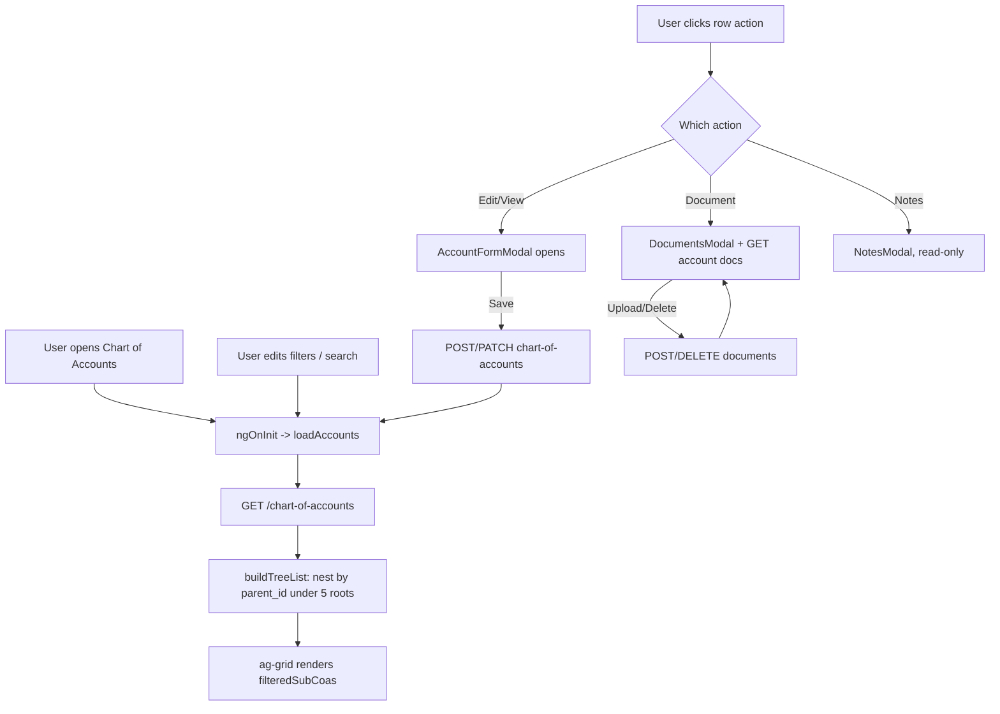

---

### 8.2 Journal Entries

**Purpose**: Register and post manual journal-entry batches (debit/credit lines against Chart of Accounts G/L codes), grouped by period and agent (MGA), with a spreadsheet-style entry form and balance validation.

**Route**: `journal-entries`, guarded by `canActivate: [permissionGuard('journal_entry')]`, lazy-loaded to `JournalEntriesComponent` (`src/app/features/journal-entries/journal-entries.component.ts`).

**Component hierarchy**:
- `JournalEntriesComponent` drives a 3-state view machine (`currentView: 'list' | 'detail' | 'form'`), all inside one template (`journal-entries.component.html`) using `@if` blocks:
  - **list**: `ag-grid-angular` over `batches: JournalEntryBatch[]`
  - **detail**: `ag-grid-angular` over `filteredEntries: JournalEntry[]`
  - **form**: `JournalEntryFormView` (`components/journal-entry-form-view/journal-entry-form-view.ts`)
- `AddBatchModal` (`components/add-batch-modal/add-batch-modal.ts`)
- `ConfirmDialogComponent` (shared, batch delete)

**Grids/fields**:
- Batch list (`batchColDefs`): `#` (row index), `BATCH` (`batch_number`, rendered as a clickable link that calls `viewBatchDetails(data)`), `AMOUNT` (`total_amount`, via `formatCurrency()`), `COUNT` (`count`), `ACTIONS` (`ActionButtonsCell` shared renderer with 3 buttons: "Journal Entry", "Print Register", "Delete"). **Note**: the `onClick` handler only implements `action === 'je'` (→ `viewBatchDetails`) and `action === 'delete'` (→ confirm + `deleteBatch`) — clicking "Print Register" currently has no wired behavior.
- Entries detail (`entriesColDefs`): `JOURNAL` (`je_number`), `DESCRIPTION`, `G/L` (`coa.account_code`), `SUB`, `DEBIT`, `CREDIT`, `DATE`, `DP`, `POLICY`, `ACTIONS` (single "Edit" button, `disabled` unless the current batch's `batch_number` is purely numeric — tested via `/^\d+$/.test(selectedBatch.batch_number)` — calling `editJournalEntry(data)`).

**Buttons and handlers**:
- "Add New" (list) → `openAddBatch()` → opens `AddBatchModal`
- Batch link click → `viewBatchDetails(batch)` (switches to `'detail'`, calls `loadBatchEntries()`)
- "Add Entry" (detail) → `openAddEntryForm()` (switches to `'form'`, seeds 2 blank rows via `createBlankRow()`, auto-increments `nextJeNumber`)
- Back arrow (detail) → `backToList()`
- Entry row "Edit" → `editJournalEntry(entry)` (loads all lines sharing that `je_number` into the form)
- Form "Add Row" → `JournalEntryFormView.addRow()` (adds a pair of blank rows, copying the previous row's description/sub/date/dp/policy/memo)
- Form row copy/delete → `copyRow(index)` / `deleteRow(index)`
- Form Post → `submitPost()` emits `post` → parent's `postJournalEntries(entries)`
- Form Cancel → `cancel()` emits `cancelled` → `cancelForm()` (back to `'detail'`)

**Search/filters**: List view — `selectedPeriod` and `selectedAgent` selects (populated from batches/MGAs, both trigger `onFilterChange()` → `loadBatches()`), plus a `searchTerm` text input wired directly to `loadBatches()` on every change (server-side `search` param, no debounce). The component also defines `selectedState`/`selectedAmountRange`/`statesOptions` fields and client-side filtering logic for them inside `loadBatches()`, but **the current template has no UI controls bound to `selectedState` or `selectedAmountRange`** — they stay at their default (`'all'`), so that filtering branch is effectively dormant. Detail view — `entriesSearchTerm` filters `allEntries` client-side in `filterEntries()` against `je_number`, `description`, `coa.account_code`, `sub`, `policy`.

**Dialogs**: `AddBatchModal` (period + submitting inputs, emits `add` → `createBatch()`), `ConfirmDialogComponent` (batch delete confirmation).

**API calls** (`services/journal-entries-api.ts`, base `${environment.apiUrl}/journal-batches`):
- `GET /journal-batches` (`getBatches(period?, agent?, search?)`) — once with empty params on `ngOnInit` (to discover distinct periods) and again with real filters from `loadBatches()`
- `GET /journal-batches/:id` (`getBatch(id)`) — on deep link via `?batchId=` query param (`checkQueryParameters()`), and again after posting entries to refresh the batch's total/count
- `POST /journal-batches` (`createBatch({period, agent_name})`) — Add Batch submit
- `DELETE /journal-batches/:id` (`deleteBatch(id)`) — after confirm
- `GET /journal-batches/:id/entries` (`getBatchEntries(batchId)`) — `loadBatchEntries()`
- `POST /journal-batches/:id/entries` (`postEntries(batchId, {je_number, lines})`) — `postJournalEntries()`
- `PATCH /journal-batches/:id` (`updateBatch(id, payload)`) is defined in the service but is **not called from the component** — only exercised in `journal-entries-api.spec.ts`.

Also fetches `ChartOfAccount[]` from `ChartOfAccountsApi.getAccounts('', true)` (filtering out parent accounts) for the G/L dropdown, and `Mga[]` from `MgasApi.getMgas('', true)` (`src/app/features/masters/services/mgas-api.ts`) for the Agent Name list and sub-ledger codes — both are the module's cross-feature dependencies.

**Loading state**: `loading` (batch list) and `loadingEntries` (detail grid) booleans, each gating a spinner/empty-state pair; `submittingBatch`/`submittingEntries` disable the respective submit buttons during in-flight requests.

**Error handling**: `ToastService.error(...)` in every error callback, generally `err.error?.message || 'Failed to ...'`. `postJournalEntries()` additionally does **client-side validation before hitting the API**: required description, required `coa_id`, exactly one of debit/credit per row, required `je_number`, and a balance check (`totalDebits === totalCredits`, rounded to cents) — any failure shows a toast and aborts the HTTP call.

**Export**: none in this module (no CSV/download button is present in Journal Entries itself).

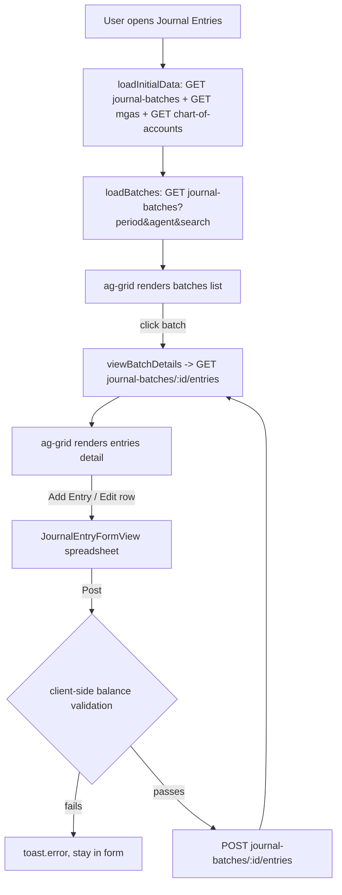

---

### 8.3 Test Balance

**Purpose**: Monthly General Ledger balance checking (Test Balance) plus two related financial statements — Balance Sheet and Profit & Loss — all selected by month/year and switched via a tab bar. This is the closest thing in the codebase to a "financial reports" screen.

**Route**: `test-balance`, guarded by `canActivate: [permissionGuard('chart_of_accounts')]` (reuses the Chart of Accounts permission — there is no separate `test_balance` permission key), lazy-loaded to `TestBalanceComponent` (`src/app/features/test-balance/test-balance.component.ts`).

**Component hierarchy**: `TestBalanceComponent` is a single component with no child components — three `*ngIf` sections in `test-balance.component.html` for the three tabs, each rendering plain HTML `<table>`s (no ag-Grid here).

**Tables rendered** (real field names from `models/test-balance.model.ts`):
- **Test Balance tab**: one card per `TestBalanceAccount` (`code`, `name`, `status`) with a table of `TestBalanceRow` (`type`, `p_balance`, `c_balance`, `difference`), plus footer rows for `bg_balance` and `current_balance`. A side panel sums `difference` across accounts per row `type` via `getDifferenceSum('IN'|'CR'|'CK'|'JE')`.
- **Balance Sheet tab**: `BalanceSheetResponse` — `assets[]`, `liabilities[]`, `equity[]` (each `FinancialReportLineItem`: `accountCode`, `description`, `balance`), with `totalAssets`, `totalLiabilities`, `totalEquity`, and a client-computed balanced/out-of-balance banner (`abs(totalAssets - (totalLiabilities + totalEquity)) < 0.01`).
- **P&L tab**: `PLStatementResponse` — `revenues[]`, `expenses[]`, `totalRevenue`, `totalExpense`, `netIncome`.

**Buttons/handlers**: Tab buttons → `selectTab('test-balance'|'balance-sheet'|'pl')` (sets `activeTab`, calls `loadData()`). Month/Year `<select>`s → `onPeriodChange()` → `loadData()`. There are no add/edit/delete actions in this module — it is read-only reporting.

**Search/filter mechanism**: none beyond the Month (`months` array Jan–Dec) and Year (`years = [2024, 2025, 2026]`) selectors, which together form the `period` string (`'${month} ${year}'`) passed to the Balance Sheet/P&L endpoints, or `month`/`year` passed separately to the Test Balance endpoint.

**Dialogs**: none.

**API calls** — routed entirely through `TestBalanceState`, never called directly by the component (see 8.3.1 below). Underlying HTTP (`services/test-balance-api.ts`):
- `GET /test-balance?month=&year=` (`getTestBalance`) — base `${environment.apiUrl}/test-balance`
- `GET /financial-reports/balance-sheet?period=` (`getBalanceSheet`) — base `${environment.apiUrl}/financial-reports`
- `GET /financial-reports/pl?period=` (`getPLStatement`)

**Loading state**: single `isLoading` flag sourced from `TestBalanceState.loading$`; template shows a centered spinner and hides all three tab sections while true.

**Error handling**: `TestBalanceState` maintains an `error$` observable (see below), but **`TestBalanceComponent` never subscribes to it** — no error message is rendered in the template. On an API error the state simply clears `loading$` and leaves the relevant data subject (`data$`/`balanceSheet$`/`pl$`) at its previous/null value, so the UI silently falls back to the "no data" empty state (the tab's `*ngIf="... && data"` guard just doesn't render).

**Export**: none — no CSV/print button exists in this module.

#### 8.3.1 `TestBalanceState` — the canonical `*-state.ts` pattern

`src/app/features/test-balance/services/test-balance-state.ts` is flagged as the project's reference implementation of the feature-local RxJS state layer. It is an `@Injectable({ providedIn: 'root' })` service, entirely separate from `TestBalanceApi` (the raw HTTP client), and is the **only** thing the component talks to.

**Internal state** — five private `BehaviorSubject`s:
- `dataSubject: BehaviorSubject<TestBalanceResponse | null>` (initial `null`)
- `balanceSheetSubject: BehaviorSubject<BalanceSheetResponse | null>` (initial `null`)
- `plSubject: BehaviorSubject<PLStatementResponse | null>` (initial `null`)
- `loadingSubject: BehaviorSubject<boolean>` (initial `false`)
- `errorSubject: BehaviorSubject<string | null>` (initial `null`)

**Public API**:
- Observables: `data$`, `balanceSheet$`, `pl$`, `loading$`, `error$` — each simply `.asObservable()` of the matching subject, so consumers can't push values in, only read.
- Synchronous getter: `get data(): TestBalanceResponse | null` — snapshot accessor for the current test-balance value without subscribing.
- Methods: `loadTestBalance(month?, year?)`, `loadBalanceSheet(period)`, `loadPLStatement(period)` — each sets `loadingSubject.next(true)` and `errorSubject.next(null)`, calls the matching `TestBalanceApi` method, and on success pushes the response into its own subject and clears loading; on error pushes a hardcoded message string (e.g. `'Error loading test balance'`) into `errorSubject` and clears loading. None of the three methods return an `Observable` — they are fire-and-forget, and the component reacts only via the exposed streams.

**What problem this solves**: if `TestBalanceComponent` called `TestBalanceApi` directly, every tab switch or period change would need its own local `loading`/`data`/`error` fields duplicated per tab, and any other component that wanted to show test-balance data (e.g. a future dashboard widget) would have to re-implement that bookkeeping and could easily get out of sync with what's currently loaded. By centralizing the three response caches and the loading/error flags in one injectable, singleton service:
1. **Multiple consumers stay in sync** — any component that injects `TestBalanceState` and subscribes to `data$`/`loading$` sees the same in-flight state as every other consumer, with no duplicate HTTP calls needed.
2. **The component becomes a thin view** — `TestBalanceComponent`'s constructor just pipes `state.data$`/`balanceSheet$`/`pl$`/`loading$` into local fields via `takeUntilDestroyed()`; it holds no request/response bookkeeping itself, only the last emitted value for template binding.
3. **Loading/error state is uniform across the 3 report types** without the component needing 3 sets of parallel booleans.
4. It gives a single seam for future caching, retry, or optimistic-update logic without touching the component.

The tradeoff visible in the code: `error$` is defined but currently orphaned (no subscriber renders it), which is a good concrete example for a new developer of how this pattern still requires each consumer to actually wire up every exposed stream — the state layer only guarantees the data exists, not that it's displayed.

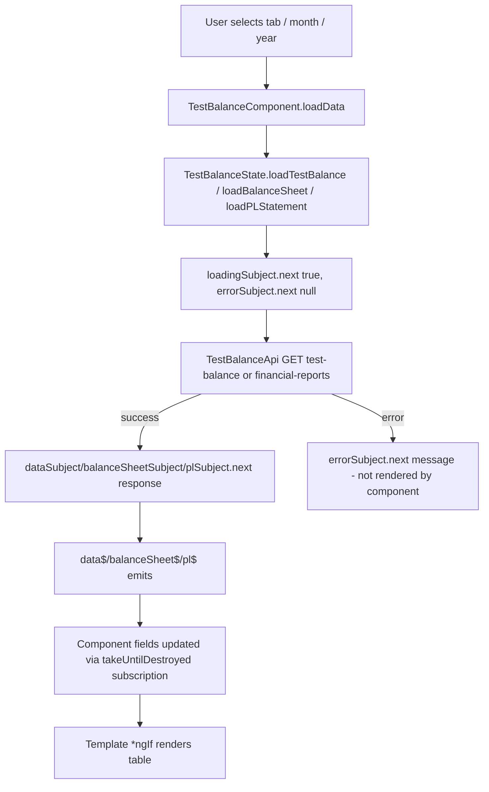

---

### 8.4 Reinsurance Calculations

**Purpose**: Analyze ceding calculations, cash settlements, and GL segment mappings for uploaded reinsurance treaty "workbooks" (spreadsheet-derived data), per program/month/state, and post the resulting GL journal entries into a real Journal Entries batch.

**Route**: `reinsurance-calculations`, guarded by `canActivate: [permissionGuard('reinsurance')]`, lazy-loaded to `ReinsuranceCalculationsComponent` (`src/app/features/reinsurance-calculations/reinsurance-calculations.component.ts`).

**Component hierarchy**:
- `ReinsuranceCalculationsComponent`
  - `SettingsAccordions` (`components/settings-accordions/settings-accordions.ts`) — 3 collapsible, **read-only** panels: Parameters, Rates, Mappings
  - Tab body, one of:
    - `StatementTab` (`components/statement-tab/statement-tab.ts`) — "📊 Base sheet"
    - `GljeTab` (`components/glje-tab/glje-tab.ts`) — "💼 GL Journal Entries"
    - `CashSettlementTab` (`components/cash-settlement-tab/cash-settlement-tab.ts`) — "💰 Cash Settlement"
  - `ConfirmDialogComponent` (shared) — post-to-journal-entries and delete-workbook confirmations

**Tabs/tables (real field names)**:
- **Base sheet / Statement** (`StatementTab`, `rows: StatementRow[]`): each row has `label`, `value`, `formula`, `isHeader`, `isBold`, `borderClass` — a formatted ceding-statement layout, currency-formatted via `formatCurrency()`.
- **GL Journal Entries** (`GljeTab`, `rows: GljeRow[]`): editable grid with columns `desc`, `comp`, `account`, `cc`, `mga`, `lob`, `st`, `ext`, `sub`, `debit`, `credit` (plus `isNew` flag for newly added rows and `lineDesc`). New rows are seeded from `GljeRowDefaults` (`comp`/`cc`/`mga`/`lob`/`ext`/`sub` pulled from the active `Workbook`).
- **Cash Settlement** (`CashSettlementTab`, `cashSettlement: CashSettlement`): `beg_bal`, `amt_paid`, `qsPct`, `reinsurerName`, and a `rows: CashSettlementRow[]` (each with `label`, `total`, `reins`, `ssic` columns) — the only editable fields are `beg_bal`/`amt_paid` via a form.

**Buttons and handlers**:
- Workbook `<select>` → `onWorkbookChange()` (loads workbook detail, rates/mappings forms, and available states)
- Delete-workbook icon button → `deleteWorkbook()` (confirm dialog, then `DELETE /workbooks/:id`)
- Reporting State `<select>` → `onStateChange()` → `loadActiveTabCalculations()`
- Tab buttons → `setTab(tab)` → `loadActiveTabCalculations()`
- `GljeTab` "➕ Add Row" → local `addRow()`, emits `rowsChanged` → parent's `onGljeRowsChanged(rows)` (also resets `isPosted = false`)
- `GljeTab` row delete (only for `isNew` rows) → `removeRow(index)`
- `GljeTab` "📥 Export Mappings to CSV" → emits `exportCsv` → parent's `exportGLJECSV()`
- `GljeTab` "Post" button → emits `post` → parent's `onPostClick()` → confirm dialog → `postToJournalEntries()`
- `CashSettlementTab` save → emits `save` → parent's `onSaveCashParams(event)` → `saveCashParams()`

**Search/filter mechanisms**: no free-text search. Filtering is entirely selection-based: Workbook dropdown (program+month+source) and Reporting State dropdown. States are derived from the workbook's `state_exhibits`/`stateExhibits` and cross-filtered against `TreatiesApi.getTreaties()` (`src/app/features/masters/services/treaties-api.ts`) matching treaty states to the workbook's `program` — the module's cross-feature dependency on `masters`.

**Dialogs**: `ConfirmDialogComponent`, reused for both "Delete Workbook" and "Post to Journal Entries Batch" confirmations via the shared `confirmOpen`/`pendingAction` pattern seen in the other modules.

**API calls** (`services/reinsurance-api.ts`, base `environment.apiUrl`; only endpoints actually exercised by this component are listed with their trigger):
- `GET /workbooks` (`getWorkbooks()`) — `ngOnInit` → `loadWorkbooks()`; results are filtered to exclude `source === 'ITD'`
- `GET /workbooks/:id` (`getWorkbook(id)`) — `onWorkbookChange()`
- `DELETE /workbooks/:id` (`deleteWorkbook(id)`) — after confirm
- `GET /workbooks/:id/reinsurance-statement/:stateCode` (`getReinsuranceStatement`) — when the Base Sheet tab is active, in `loadActiveTabCalculations()`
- `GET /workbooks/:id/gl-journal-entries/:stateCode` (`getGLJournalEntries`) — GLJE tab active
- `GET /workbooks/:id/cash-settlement-calculations?stateCode=` (`getCashSettlementCalculations`) — Cash Settlement tab active
- `PUT /workbooks/:id/cash-settlement` (`updateCashSettlement`) — `saveCashParams()`, then re-runs `onWorkbookChange()` to refresh
- `POST /workbooks/:id/post-to-journal-entries/:stateCode` — **called with a raw, direct `this.service['http'].post(...)` using the service's private `http`/`apiUrl` fields** (accessed via bracket-notation, bypassing a dedicated `ReinsuranceApi` method) — body `{ customRows: gljeRows }`; on success, navigates to `/journal-entries` with `queryParams: { batchId: batch.id }`, which is exactly the deep-link mechanism `JournalEntriesComponent.checkQueryParameters()` consumes (see 8.2).
- `GET /workbooks/programs`, `POST /workbooks/upload`, `PUT /workbooks/:id/exhibits/:stateCode`, `PUT /workbooks/:id/rates`, `PUT /workbooks/:id/mappings`, `POST /database/clear`, `POST /database/seed`, `GET /database/seeder-files`, `PUT /database/seeder-files/:stateCode`, `GET /database/check-itd-seeded`, `POST /workbooks/manual-itd` are all defined on `ReinsuranceApi` but **not called from `ReinsuranceCalculationsComponent`** — workbook upload lives instead in `src/app/features/masters/components/treaty-uploads-panel/treaty-uploads-panel.ts`, and the Parameters/Rates/Mappings accordions in this module are read-only display (no save button is wired to `updateRates`/`updateMappings`/`updateExhibit`).

**Loading state**: `loading` boolean gates a full-tab overlay spinner ("Loading ceding calculations..."); `postingBatch` disables the Post button during the post-to-journal-entries call.

**Error handling**: `ToastService.error(...)` on every failed call (workbook list/detail/delete, post-to-journal-entries with `err.error?.message || 'Failed to post to journal entries'`). Note that the three `loadActiveTabCalculations()` branches (statement/GLJE/cash) only clear `loading` on error and do **not** show a toast — a failed tab load just leaves the tab's data array/object at its previous value with no user-visible error.

**Export**: `exportGLJECSV()` (in `ReinsuranceCalculationsComponent`) — builds a CSV string client-side from `gljeRows` (columns: Account Description, Comp, ACCOUNT, CC, MGA, LOB, ST, EXT, Sub, Description, Debit, Credit, plus a "JE Control Totals" row) and downloads it via a Blob/anchor click, filename `GL_JE_Mapping_${program}_${month_key}_${state}.csv`. This is a hand-rolled equivalent of Chart of Accounts' `downloadCSV()` but not shared code — each module reimplements its own CSV builder.

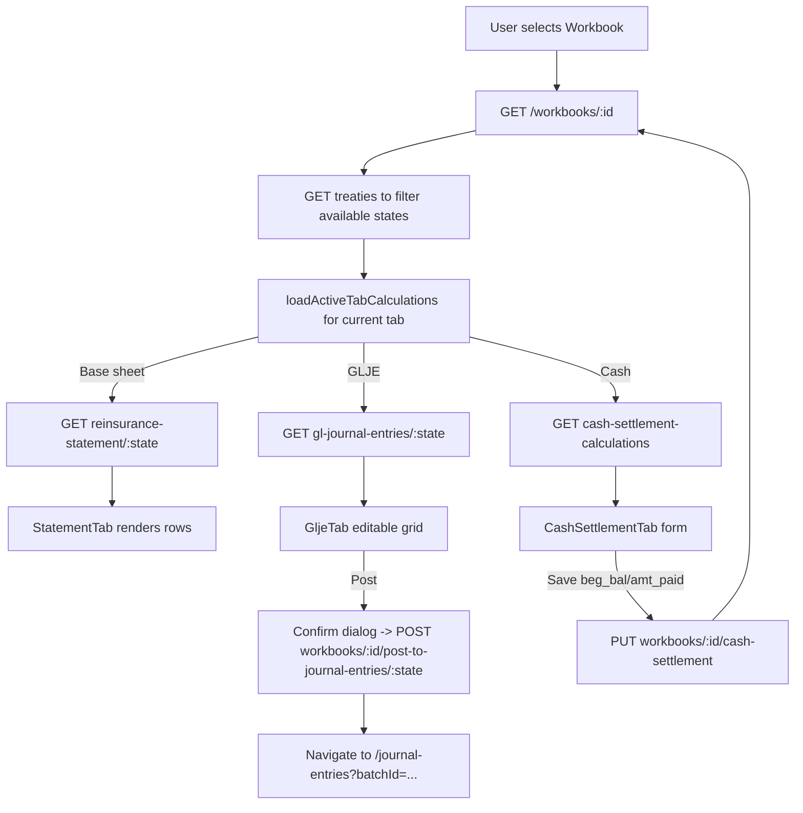

---

### 8.5 Endpoint summary across all four modules

| Method | Path | Service.method | Module |
|---|---|---|---|
| GET | `/chart-of-accounts` | `ChartOfAccountsApi.getAccounts` | Chart of Accounts |
| GET | `/chart-of-accounts/:id` | `ChartOfAccountsApi.getAccount` | Chart of Accounts |
| POST | `/chart-of-accounts` | `ChartOfAccountsApi.createAccount` | Chart of Accounts |
| PATCH | `/chart-of-accounts/:id` | `ChartOfAccountsApi.updateAccount` | Chart of Accounts |
| DELETE | `/chart-of-accounts/:id` | `ChartOfAccountsApi.deleteAccount` | Chart of Accounts |
| POST | `/chart-of-accounts/:id/documents` | `ChartOfAccountsApi.uploadDocument` | Chart of Accounts |
| DELETE | `/chart-of-accounts/documents/:id` | `ChartOfAccountsApi.deleteDocument` | Chart of Accounts |
| GET | `/chart-of-accounts/documents/download/:file_url` | window.open (no service method) | Chart of Accounts |
| GET | `/journal-batches` | `JournalEntriesApi.getBatches` | Journal Entries |
| GET | `/journal-batches/:id` | `JournalEntriesApi.getBatch` | Journal Entries |
| POST | `/journal-batches` | `JournalEntriesApi.createBatch` | Journal Entries |
| PATCH | `/journal-batches/:id` | `JournalEntriesApi.updateBatch` (defined, unused by any component) | Journal Entries |
| DELETE | `/journal-batches/:id` | `JournalEntriesApi.deleteBatch` | Journal Entries |
| GET | `/journal-batches/:id/entries` | `JournalEntriesApi.getBatchEntries` | Journal Entries |
| POST | `/journal-batches/:id/entries` | `JournalEntriesApi.postEntries` | Journal Entries |
| GET | `/test-balance` | `TestBalanceApi.getTestBalance` (via `TestBalanceState.loadTestBalance`) | Test Balance |
| GET | `/financial-reports/balance-sheet` | `TestBalanceApi.getBalanceSheet` (via `TestBalanceState.loadBalanceSheet`) | Test Balance |
| GET | `/financial-reports/pl` | `TestBalanceApi.getPLStatement` (via `TestBalanceState.loadPLStatement`) | Test Balance |
| GET | `/workbooks` | `ReinsuranceApi.getWorkbooks` | Reinsurance Calculations |
| GET | `/workbooks/:id` | `ReinsuranceApi.getWorkbook` | Reinsurance Calculations |
| DELETE | `/workbooks/:id` | `ReinsuranceApi.deleteWorkbook` | Reinsurance Calculations |
| GET | `/workbooks/:id/reinsurance-statement/:stateCode` | `ReinsuranceApi.getReinsuranceStatement` | Reinsurance Calculations |
| GET | `/workbooks/:id/gl-journal-entries/:stateCode` | `ReinsuranceApi.getGLJournalEntries` | Reinsurance Calculations |
| GET | `/workbooks/:id/cash-settlement-calculations` | `ReinsuranceApi.getCashSettlementCalculations` | Reinsurance Calculations |
| PUT | `/workbooks/:id/cash-settlement` | `ReinsuranceApi.updateCashSettlement` | Reinsurance Calculations |
| POST | `/workbooks/:id/post-to-journal-entries/:stateCode` | raw `this.service['http'].post(...)` (bypasses a named service method) | Reinsurance Calculations |
| GET | `/workbooks/programs` | `ReinsuranceApi.getPrograms` (defined, not called from this component) | Reinsurance Calculations |
| PUT | `/workbooks/:id/exhibits/:stateCode` | `ReinsuranceApi.updateExhibit` (defined, not called from this component) | Reinsurance Calculations |
| PUT | `/workbooks/:id/rates` | `ReinsuranceApi.updateRates` (defined, not called from this component) | Reinsurance Calculations |
| PUT | `/workbooks/:id/mappings` | `ReinsuranceApi.updateMappings` (defined, not called from this component) | Reinsurance Calculations |
| POST | `/workbooks/upload` | `ReinsuranceApi.uploadWorkbook` (called from `masters/treaty-uploads-panel`, not this module) | Reinsurance Calculations (service only) |
| POST | `/database/clear` | `ReinsuranceApi.clearDatabase` (defined, not called from this component) | Reinsurance Calculations |
| POST | `/database/seed` | `ReinsuranceApi.seedDatabase` (defined, not called from this component) | Reinsurance Calculations |
| GET | `/database/seeder-files` | `ReinsuranceApi.getSeederFiles` (defined, not called from this component) | Reinsurance Calculations |
| PUT | `/database/seeder-files/:stateCode` | `ReinsuranceApi.updateSeederFile` (defined, not called from this component) | Reinsurance Calculations |
| GET | `/database/check-itd-seeded` | `ReinsuranceApi.checkItdSeeded` (defined, not called from this component) | Reinsurance Calculations |
| POST | `/workbooks/manual-itd` | `ReinsuranceApi.createManualITD` (defined, not called from this component) | Reinsurance Calculations |

Cross-module dependencies used by these four features but owned by `src/app/features/masters/`: `DocumentTypesApi` (Chart of Accounts, for the document-type dropdown), `MgasApi` (Journal Entries, for the Agent Name filter and sub-ledger codes), `TreatiesApi` (Reinsurance Calculations, for state filtering). `masters/services/masters-api.ts` itself is **not** imported by any of the four modules.

---

## 9. Reports

The original documentation outline for this handover requested a chapter named "Reports." **No module, route, component, or service literally named "Reports" exists anywhere in this codebase.** A full search of `src/app/features/` confirms the only feature folders are: `auth`, `dashboard`, `chart-of-accounts`, `journal-entries`, `masters`, `reinsurance-calculations`, `test-balance`, `user-management`.

The closest real functionality to "reporting" in this app is:

- **Test Balance** (`/test-balance`, Chapter 8 §8.3) — includes the Balance Sheet and P&L Statement tabs, which are the closest things in the codebase to financial reports. `TestBalanceComponent` is read-only, selection-driven (month/year), and has no export/print button.
- **Activity Logs** (`/user-management/activity-logs`, Chapter 10) — an audit-trail report with filters, a data grid, and a real server-side CSV export (`GET /activity-logs/export`).
- Several modules have ad-hoc, per-module CSV exports (Users, Chart of Accounts, all 14 Masters tabs, Reinsurance Calculations' GLJE tab) — each is a hand-rolled client-side CSV builder (see Chapter 15 note and the `csv-export.util.ts` reference in Chapter 6 §6.6), not a unified "Reports" feature.

If a future task asks you to "add a Reports module," there is no existing scaffold to extend — you would be starting a new feature folder from scratch, most likely modeled after `test-balance/`'s `*-state.ts` pattern (Chapter 16) given that it is the module doing the most report-like data presentation today.

---

## 10. Activity Logs

Activity Logs is a sub-route of the User Management module (`/user-management/activity-logs`), already introduced in Chapter 5 §5.4. This chapter expands on it as its own topic per the requested document outline, since it functions as the application's audit-log / activity-report screen.

**Purpose**: A searchable, filterable audit trail of user actions across the whole application (logins, CRUD operations, approvals, exports, session events), primarily for compliance and troubleshooting.

**Navigation & route**: Sidebar → User Management → Activity Logs, or directly at `/user-management/activity-logs`. Guarded (one level up) by `canActivate: [permissionGuard('user_management')]` on the parent `/user-management` route in `app.routes.ts`; the route itself in `user-management.routes.ts` adds no further guard.

**Component**: `ActivityLogsComponent` (`src/app/features/user-management/activity-logs/activity-logs.component.ts`).

**Search**: A free-text search field lives inside `ActivityFiltersComponent` (`activity-logs/components/activity-filters/`), two-way bound to the parent's mutable `filter.search` field (`ActivityLogsFilter`). There is **no debounce** on this field — every `(ngModelChange)` immediately emits `filterChange`, which the parent's `onFilterChange()` handles by resetting to page 1 and calling `loadLogs()` — i.e., a full server round-trip on every keystroke (unlike the debounced search on the Users list, Chapter 5 §5.2).

**Filters**: Action `<select>` (`login`/`logout`/`create`/`update`/`delete`/`approve`/`export`), Module `<select>` (populated from `PermissionsApi.getModules()` → `GET {apiUrl}/permissions/modules`), and a From/To date range (`filter.date_from`/`filter.date_to`). A "Reset" button clears all 5 fields and reloads; an "Apply Filters" button is present but redundant, since every field already triggers a reload on change.

**Pagination**: Server-side, sliding 5-page window (`pageNumbers` getter, `currentPage ± 2` clamped to `[1, totalPages]`), same pattern as Users/Roles. Driven by `goToPage(page)`, which sets both `filter.page` and `currentPage` before calling `loadLogs()`.

**Table**: `ag-grid-angular`, columns USER (`UserCellRenderer`), ACTION (`ActionBadgeRenderer` — colored pill per action type), MODULE (`formatModule(module_id)` — a hard-coded id→label map with an API-driven fallback), ENTITY, DESCRIPTION, IP ADDRESS, DEVICE/BROWSER, LOCATION, DATE & TIME, STATUS (`StatusBadgeRenderer`). Clicking anywhere on a row (`gridOptions.onRowClicked`) opens the detail drawer.

**Actions**: Clicking a row → `openDrawer(event.data)` → `ActivityDrawerComponent` slides in with full detail (Overview, Field Changes, Technical Metadata). Closing sets `drawerOpen = false` immediately and defers clearing `selectedLog = null` by `setTimeout(..., 300)` to let the CSS close-animation finish.

**Dialogs**: Only the slide-over drawer — no modal dialogs in this sub-feature.

**Service**: `ActivityLogsApi` (`activity-logs/services/activity-logs-api.ts`), scoped to this sub-feature (not shared with the rest of `user-management`).

**API calls**:

| Method | Path | Purpose |
|---|---|---|
| GET | `/activity-logs` | `getLogs(filter)` — main list, called by `loadLogs()` |
| GET | `/activity-logs/stats` | `getStats()` — populates the 5 summary cards, re-run after every `loadLogs()` |
| GET | `/activity-logs/export` | `exportLogs(filter)` — `responseType: 'blob'`, server-generated CSV |
| GET | `/permissions/modules` | `PermissionsApi.getModules()` — populates the Module filter dropdown |

**Rendering caveat worth knowing**: `loadLogs()` pipes every returned log through `injectMockData(log)`, which **randomly fabricates** `ip_address`, `status`, `device`, `browser`, `location`, `os`, `session_id`, and `correlation_id` whenever the backend value is missing, `'-'`, or `'unknown'` — explicitly commented in the source as mock UI data the backend doesn't yet provide. This means the IP/device/browser/location/session fields visible in the grid and drawer are frequently randomized placeholders, not real audit data, whenever the backend omits them — do not treat what you see in this screen as ground truth without checking whether the backend actually returned that field.

For the full grid-column reference, drawer field list, and status-color mapping, see Chapter 5 §5.4.

---

## 11. Routing Documentation

### 11.1 Top-level routes (`src/app/app.routes.ts`)

| Path | Loaded via | Target | Guards |
|---|---|---|---|
| `''` | `redirectTo: 'auth/login'` (`pathMatch: 'full'`) | — | none |
| `auth` | `loadChildren` | `./features/auth/auth.routes.ts` → `authRoutes` | none |
| `''` (wraps children below) | `component` | `MainLayoutComponent` | `authGuard` |
| ↳ `user-management` | `loadChildren` | `./features/user-management/user-management.routes.ts` → `userManagementRoutes` | `permissionGuard('user_management')` |
| ↳ `dashboard` | `loadComponent` | `DashboardComponent` | none (only inherited `authGuard`) |
| ↳ `chart-of-accounts` | `loadComponent` | `ChartOfAccountsComponent` | `permissionGuard('chart_of_accounts')` |
| ↳ `journal-entries` | `loadComponent` | `JournalEntriesComponent` | `permissionGuard('journal_entry')` |
| ↳ `test-balance` | `loadComponent` | `TestBalanceComponent` | `permissionGuard('chart_of_accounts')` (reuses the COA permission — no dedicated `test_balance` key) |
| ↳ `reinsurance-calculations` | `loadComponent` | `ReinsuranceCalculationsComponent` | `permissionGuard('reinsurance')` |
| ↳ `masters` | `loadChildren` | `./features/masters/masters.routes.ts` → `mastersRoutes` | `permissionGuard('master_data')` |
| ↳ `''` | `redirectTo: 'user-management/users'` (`pathMatch: 'full'`) | — | inherits `authGuard` |
| `**` | `redirectTo: 'auth/login'` | — | none |

### 11.2 Feature-internal route files

**`src/app/features/auth/auth.routes.ts`** (`authRoutes`):

```ts
export const authRoutes: Routes = [
  { path: '', redirectTo: 'login', pathMatch: 'full' },
  { path: 'login', loadComponent: () => import('./login/login.component').then(m => m.LoginComponent) },
  { path: 'otp', loadComponent: () => import('./otp/otp.component').then(m => m.OtpComponent) },
  { path: 'session-conflict', loadComponent: () => import('./session-conflict/session-conflict.component').then(m => m.SessionConflictComponent) },
];
```

**`src/app/features/user-management/user-management.routes.ts`** (`userManagementRoutes`):

| Path (relative to `/user-management`) | Component |
|---|---|
| `''` | redirects to `users` |
| `users` | `UsersComponent` |
| `roles` | `RolesComponent` |
| `roles/create` | `RoleFormComponent` |
| `roles/edit/:id` | `RoleFormComponent` (same class, `:id` param switches it to edit mode) |
| `activity-logs` | `ActivityLogsComponent` |

**`src/app/features/masters/masters.routes.ts`** (`mastersRoutes`) — deliberately minimal, since Masters does **not** use child routes for its 14 "tabs":

```ts
export const mastersRoutes: Routes = [
  { path: '', component: MastersComponent },
];
```

All 14 Masters "tabs" (Treaties, MGAs, LOBs, COBs, States, Reinsurers, Risk Companies, GL Mappings, Brokers, Products, Locked Periods, Document Types, Sequence Prefix Counters, Treaty Types) are switched client-side inside `MastersComponent` via a `tab` **query parameter**, not via the Angular Router's route tree — see Chapter 6 §6.1 for the exact mechanism (`selectTab()`/`syncTabFromUrl()`). This is a deliberate architectural choice: it keeps 14 variants deep-linkable and bookmarkable (`/masters?tab=mgas`) without needing 14 separate lazy-loaded route entries.

No other feature (`dashboard`, `chart-of-accounts`, `journal-entries`, `test-balance`, `reinsurance-calculations`) defines its own `*.routes.ts` file — each is a single `loadComponent` leaf directly in `app.routes.ts`.

### 11.3 Guards applied, in one place

| Guard | Applied to | Argument(s) |
|---|---|---|
| `authGuard` | The entire `MainLayoutComponent` subtree (everything except `/auth/*`) | none |
| `permissionGuard('user_management')` | `/user-management/*` | module = `user_management`, action defaults to `'view'` |
| `permissionGuard('chart_of_accounts')` | `/chart-of-accounts`, `/test-balance` | module = `chart_of_accounts` |
| `permissionGuard('journal_entry')` | `/journal-entries` | module = `journal_entry` |
| `permissionGuard('reinsurance')` | `/reinsurance-calculations` | module = `reinsurance` |
| `permissionGuard('master_data')` | `/masters/*` | module = `master_data` |
| none | `/dashboard` | any authenticated user |

Full guard implementation (exact code, redirect targets, and the `hasPermission()` matching logic) is in [Chapter 17](#17-guards--interceptors) — this chapter only maps *which* routes use *which* guard argument.

### 11.4 Full routing tree diagram

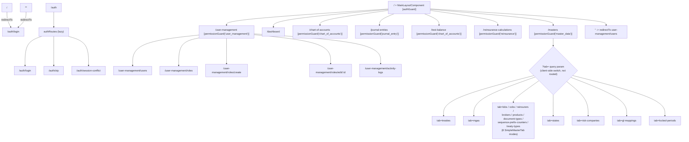

---

## 12. Components Documentation

This chapter is an index of every component in the app. Full behavioral detail (Inputs/Outputs, event handlers, service calls) for each component already appears in its owning feature chapter — this table exists so a new developer can find "where does X live and what does it roughly do" in one place, without re-deriving it. Shared/reusable components get their full Input/Output contract in [Chapter 14](#14-shared-components) rather than repeated here.

### Layout & shell components

| Component | Path | Purpose | Detail in |
|---|---|---|---|
| `AppComponent` | `app.component.ts` | Root shell — just `<router-outlet/>`; on init, silently refreshes the session via `AuthService.fetchCurrentUser()` | Chapter 2 |
| `MainLayoutComponent` | `layout/main-layout/` | Authenticated app shell: `<app-sidebar>` + `<app-header>` + `<router-outlet>` + `<app-toast>` | Chapter 2 |
| `SidebarComponent` | `layout/sidebar/` | Left navigation, permission-driven visibility, collapse/expand via `SidebarState` | Chapter 16 |
| `HeaderComponent` | `layout/header/` | Topbar, user menu, Sign Out action | Chapter 3 §3.7 |

### Auth components

| Component | Path | Purpose | Detail in |
|---|---|---|---|
| `LoginComponent` | `features/auth/login/` | Email/password form + admin-invite acceptance flow | Chapter 3 §3.2 |
| `OtpComponent` | `features/auth/otp/` | 6-digit OTP entry with auto-focus/paste/auto-submit | Chapter 3 §3.3 |
| `SessionConflictComponent` | `features/auth/session-conflict/` | "Already signed in elsewhere" resolution screen | Chapter 3 §3.5 |

### Dashboard

| Component | Path | Purpose | Detail in |
|---|---|---|---|
| `DashboardComponent` | `features/dashboard/` | Static placeholder landing page (no logic) | Chapter 4 |

### User Management components

| Component | Path | Purpose | Detail in |
|---|---|---|---|
| `UsersComponent` | `user-management/users/` | Users list page: toolbar, stats, pagination | Chapter 5 §5.2 |
| `UsersTableComponent` | `user-management/users/users-table/` | ag-Grid wrapper for the users list | Chapter 5 §5.2 |
| `InvitePanelComponent` | `user-management/users/invite-panel/` | Slide-over invite form | Chapter 5 §5.2 |
| `UserDetailPanelComponent` | `user-management/users/user-detail-panel/` | Slide-over view/edit + permissions tabs | Chapter 5 §5.2 |
| `UserStatusBadgeComponent` | `user-management/users/user-status-badge/` | Small colored status pill | Chapter 5 §5.2 |
| `RolesComponent` | `user-management/roles/` | Role card grid | Chapter 5 §5.3 |
| `RoleFormComponent` | `user-management/roles/role-form/` | Full-page create/edit role + permission accordion | Chapter 5 §5.3 |
| `RolePermissionsModalComponent` | `user-management/roles/role-permissions-modal/` | Equivalent modal form — **unused/orphaned, not wired to any route** | Chapter 5 §5.1 |
| `ActivityLogsComponent` | `user-management/activity-logs/` | Audit log page | Chapters 5 §5.4, 10 |
| `ActivityHeaderComponent` | `activity-logs/components/activity-header/` | Title + Export button | Chapter 10 |
| `ActivitySummaryCardsComponent` | `activity-logs/components/activity-summary-cards/` | 5 stat cards | Chapter 10 |
| `ActivityFiltersComponent` | `activity-logs/components/activity-filters/` | Search/action/module/date filters | Chapter 10 |
| `ActivityDrawerComponent` | `activity-logs/components/activity-drawer/` | Row detail slide-over | Chapter 10 |
| Renderers (`UserCellRenderer`, `ActionBadgeRenderer`, `StatusBadgeRenderer`) | `activity-logs/components/renderers/` | ag-Grid cell renderers specific to this grid | Chapter 10 |

### Masters components

| Component | Path | Purpose | Detail in |
|---|---|---|---|
| `MastersComponent` | `masters/masters.component.ts` | Tab shell, query-param-driven tab switching | Chapter 6 §6.1 |
| `SimpleMasterTab` | `masters/components/simple-master-tab/` | Generic component driving 8 entity types | Chapter 6 §6.2 |
| `SimpleFormModal` | `masters/components/simple-form-modal/` | Generic add/edit/view dialog for the 8 simple entities | Chapter 6 §6.2 |
| `MastersGrid` | `masters/components/masters-grid/` | Shared ag-Grid wrapper used by all 14 tabs | Chapter 6 §6.3 |
| `DocumentDrawer` | `masters/components/document-drawer/` | Shared upload/list/download/delete drawer (Mgas/States/RiskCompanies) | Chapter 6 §6.4 |
| `TreatiesTab` + `TreatyFormModal` + `ItdFormModal` + `TreatyUploadsPanel` | `masters/components/treaties-tab/`, `treaty-form-modal/`, `itd-form-modal/`, `treaty-uploads-panel/` | Treaty CRUD, ITD workbook management | Chapter 6 §6.8 |
| `MgasTab` + `MgaFormModal` | `masters/components/mgas-tab/`, `mga-form-modal/` | MGA CRUD, documents, cross-tab treaty quick-add | Chapter 7 |
| `StatesTab` + `StateFormModal` | `masters/components/states-tab/`, `state-form-modal/` | State CRUD, documents, notes | Chapter 6 §6.8 |
| `GlMappingsTab` + `GlMappingFormModal` | `masters/components/gl-mappings-tab/`, `gl-mapping-form-modal/` | GL Mapping CRUD (client-side filtered) | Chapter 6 §6.8 |
| `RiskCompaniesTab` + `RiskCompanyFormModal` | `masters/components/risk-companies-tab/`, `risk-company-form-modal/` | Risk Company CRUD, documents | Chapter 6 §6.8 |
| `LockedPeriodsTab` + `LockPeriodModal` | `masters/components/locked-periods-tab/`, `lock-period-modal/` | Period lock/unlock | Chapter 6 §6.8 |

### Chart of Accounts, Journal Entries, Test Balance, Reinsurance Calculations

| Component | Path | Purpose | Detail in |
|---|---|---|---|
| `ChartOfAccountsComponent` + `CoaGridCellRenderer` + `AccountFormModal` + `DocumentsModal` | `chart-of-accounts/` | COA tree grid, sub-account CRUD, documents | Chapter 8 §8.1 |
| `JournalEntriesComponent` + `JournalEntryFormView` + `AddBatchModal` | `journal-entries/` | Batch list → entries detail → spreadsheet-style posting form | Chapter 8 §8.2 |
| `TestBalanceComponent` | `test-balance/` | 3-tab reporting screen (Test Balance / Balance Sheet / P&L), no child components | Chapter 8 §8.3 |
| `ReinsuranceCalculationsComponent` + `SettingsAccordions` + `StatementTab` + `GljeTab` + `CashSettlementTab` | `reinsurance-calculations/` | Workbook-driven ceding calculations, GL posting | Chapter 8 §8.4 |

### Shared/reusable components

See [Chapter 14](#14-shared-components) for the full Input/Output contract of every component listed here: `ToastComponent`, `ConfirmDialogComponent`, `LoadingSpinnerComponent`, `DropdownSearchComponent<T>`, `NotesModal`, `AvatarCell`, `StatusBadgeCell`, `ActionButtonsCell`.

---

## 13. Services Documentation

This chapter indexes every injectable service in the app. Full method-by-method / endpoint-by-endpoint tables already exist per feature — this is the map.

### Core services (`src/app/core/services/`)

| Service | Public methods | Reusability |
|---|---|---|
| `AuthService` | `login`, `verifyOtp`, `resolveChallenge`, `storeSession`, `isLoggedIn`, `getToken`, `getCurrentUser`, `hasPermission(moduleOrPermission, action?)`, `logout`, `getInviteDetails`, `acceptInvite`, `fetchCurrentUser` | Used app-wide — guards, interceptor, `AppComponent`, `SidebarComponent`, `HeaderComponent`, every permission check in every feature |
| `AgGridConfigService` | `getDefaultGridOptions()`, `getDefaultColDef()` | Used by every feature rendering an ag-Grid table (11+ files) |

### Feature API services (`*-api.ts` — thin `HttpClient` wrappers, one per backend resource)

| Feature | Services |
|---|---|
| Auth | (none separate — all HTTP calls live directly on `AuthService`) |
| User Management | `UsersApi`, `RolesApi`, `PermissionsApi` (shared across `users/`+`roles/`), `ActivityLogsApi` (scoped to `activity-logs/`) |
| Chart of Accounts | `ChartOfAccountsApi` (also consumed by `journal-entries` and `masters`) |
| Journal Entries | `JournalEntriesApi` |
| Test Balance | `TestBalanceApi` (never called directly by the component — always through `TestBalanceState`, see Chapter 16) |
| Reinsurance Calculations | `ReinsuranceApi` (also consumed by `masters/treaty-uploads-panel`) |
| Masters | `LobsApi`, `CobsApi`, `ReinsurersApi`, `BrokersApi`, `ProductsApi`, `DocumentTypesApi` (also used by Chart of Accounts), `SequencePrefixCountersApi`, `TreatyTypesApi`, `TreatiesApi`, `MgasApi` (also used by Journal Entries), `StatesApi`, `RiskCompaniesApi`, `GlMappingsApi`, `LockedPeriodsApi` |

Every `*-api.ts` follows the same shape: `@Injectable({ providedIn: 'root' })`, `private http = inject(HttpClient)`, a `base` string built from `environment.apiUrl`, and one method per HTTP verb needed (typically `get*`, `create*`, `update*`, `delete*`). None of these services hold state — they return `Observable`s directly from `HttpClient` calls and let the caller (component or `*-state.ts` service) decide what to do with the response. Full endpoint tables are in each feature's chapter (5, 6, 7, 8).

### Feature state services (`*-state.ts` — RxJS-backed, hold in-memory data)

| Service | Feature | Backing pattern |
|---|---|---|
| `TestBalanceState` | Test Balance | 5 `BehaviorSubject`s — the project's canonical reference implementation, see Chapter 16 |
| `TreatiesState`, `MgasState`, `StatesState`, `GlMappingsState`, `RiskCompaniesState`, `LockedPeriodsState`, `SimpleMastersState` | Masters | Plain class fields holding the last-fetched array (not `BehaviorSubject`-backed) + `load`/`save`/`delete` methods returning `Observable`s |
| `DocumentsDrawerState` | Masters (shared by Mgas/States/RiskCompanies) | Dispatches to the correct `*Api` based on a `DocumentMode` enum |
| `TreatyQuickAddState` | Masters | Trivial single-field (`pendingMgaId`) cross-tab handoff, not `BehaviorSubject`-backed |

See [Chapter 16](#16-state-management) for a full explanation of why this pattern exists and how it differs from calling an API service directly.

### Shared services

| Service | Path | Purpose |
|---|---|---|
| `ToastService` | `shared/components/toast/toast.service.ts` | Global `BehaviorSubject<Toast[]>`-backed notification queue |

Full method signatures for `ToastService` are in [Chapter 14](#14-shared-components).

---

## 14. Shared Components

All components below live under `src/app/shared/components/` and are declared `standalone` (or standalone-by-default) with no dependency on any specific feature.

| Component | Path | Purpose |
|---|---|---|
| `ToastComponent` | `shared/components/toast/toast.component.ts` | Renders the global toast/notification stack |
| `ConfirmDialogComponent` | `shared/components/confirm-dialog/confirm-dialog.component.ts` | Generic confirm/cancel modal dialog |
| `LoadingSpinnerComponent` | `shared/components/loading-spinner/loading-spinner.component.ts` | Simple sizable CSS spinner |
| `DropdownSearchComponent<T>` | `shared/components/dropdown-search/dropdown-search.component.ts` | Generic searchable single/multi select |
| `NotesModal` | `shared/components/notes-modal/notes-modal.ts` | Generic read-only text/notes display modal |
| `AvatarCell` | `shared/components/grid-renderers/avatar-cell/avatar-cell.ts` | ag-Grid cell renderer showing a user avatar + name/email |
| `StatusBadgeCell` | `shared/components/grid-renderers/status-badge-cell/status-badge-cell.ts` | ag-Grid cell renderer showing a colored status badge |
| `ActionButtonsCell` | `shared/components/grid-renderers/action-buttons-cell/action-buttons-cell.ts` | ag-Grid cell renderer showing row action buttons |

### `ToastComponent` + `ToastService`
- `ToastService` (`toast.service.ts`, `providedIn: 'root'`) is a `BehaviorSubject<Toast[]>`-backed singleton exposing `toasts$: Observable<Toast[]>` and methods `show(type: ToastType, message: string, title?: string)`, `success(message, title?)`, `error(message, title?)`, `warning(message, title?)`, `info(message, title?)`, and `dismiss(id: string)`. Every toast auto-dismisses after **4000ms** via `setTimeout`. Each `Toast` gets a `crypto.randomUUID()` id.
- `ToastComponent` has **no `@Input`/`@Output`** — it subscribes directly to `ToastService.toasts$` (`toasts$ = this.toastService.toasts$`) and calls `dismiss(id)` on close-button click. It is meant to be mounted exactly once, at the shell level — it is instantiated in `MainLayoutComponent`'s template as `<app-toast />`. Any component anywhere in the app triggers a toast by `inject(ToastService)` and calling `.success()`/`.error()`/etc. — no wiring needed at the call site.
- Reusability: fully decoupled from callers via the shared singleton service; can be dropped into any layout.

### `ConfirmDialogComponent` (`confirm-dialog.component.ts`)
- `@Input() open: boolean = false` — controls visibility.
- `@Input() title: string = 'Confirm Action'`
- `@Input() message: string = 'Are you sure you want to proceed?'`
- `@Input() confirmLabel: string = 'Confirm'`
- `@Input() cancelLabel: string = 'Cancel'`
- `@Input() type: ConfirmDialogType = ConfirmDialogType.Danger` (enum: `Danger | Warning | Info`, drives icon + confirm-button styling)
- `@Output() confirmed = new EventEmitter<void>()`
- `@Output() cancelled = new EventEmitter<void>()`
- Usage: the parent owns the `open` boolean (typically toggled before a destructive action) and listens to `(confirmed)`/`(cancelled)`. Clicking the overlay itself also triggers `onCancel()`. Fully generic/stateless — reusable for any confirm-before-action UX (delete, deactivate, etc.). This is the single most-reused component in the app — every feature chapter in this document references it for delete/deactivate/lock confirmations.

### `LoadingSpinnerComponent` (`loading-spinner.component.ts`)
- `@Input() size = 24` — sets `width.px`/`height.px` directly on the spinner `<div>`.
- No `@Output()`. Purely presentational.

### `DropdownSearchComponent<T extends object = Record<string, unknown>>` (`dropdown-search.component.ts`)
Generic type-parameterized searchable select, usable with any item shape:
- `@Input() items: T[] = []`
- `@Input() isMultiSelect: boolean = false`
- `@Input() bindValue: string = 'id'` — property name read off each item as its unique value
- `@Input() placeholder: string = 'Select option'`
- `@Input() itemLabelFn: (item: T) => string` — default reads the `name` field
- `@Input() disabled: boolean = false`
- `@Input() selectedValue: unknown = null` / `@Output() selectedValueChange = new EventEmitter<unknown>()` — single-select two-way binding pair (`[(selectedValue)]`)
- `@Input() selectedValues: { [key: string]: boolean } = {}` / `@Output() selectedValuesChange = new EventEmitter<{[key:string]: boolean}>()` — multi-select two-way binding pair (`[(selectedValues)]`)
- Implements `OnInit`, `OnChanges` (re-filters when `items`/`selectedValue`/`selectedValues` inputs change); uses `HostListener('document:click')` + injected `ElementRef` to close the dropdown when clicking outside. Exposes `selectAll()`/`deselectAll()` for multi-select mode.
- Reusability: fully generic via `<T>`, works with any array of objects as long as `bindValue` and `itemLabelFn` are configured appropriately — used across master-data and user-management pickers (e.g. the Product form's LOB/COB multi-select in Chapter 6 §6.2).

### `NotesModal` (`notes-modal.ts`)
- `@Input() open = false`
- `@Input() title = ''`
- `@Input() text = ''`
- `@Output() closed = new EventEmitter<void>()`
- Minimal generic modal for showing a block of read-only text — used by States and Risk Companies (Chapter 6 §6.8) for their "Notes" action button.

### ag-Grid cell renderers (`shared/components/grid-renderers/`)
All three implement ag-Grid Angular's `ICellRendererAngularComp` interface (`agInit(params)` / `refresh(params): boolean`), so they plug into any `ColDef.cellRenderer`.

| Renderer | Params interface | Key behavior |
|---|---|---|
| `AvatarCell` | `AvatarCellRendererParams` (`value?: AvatarCellUser \| string`, `data?: {user?: AvatarCellUser} & AvatarCellUser`) | Derives `name`, `email`, `initials`, `avatarColor` from either the cell value directly, `data.user`, or `data` itself; computes initials from first+last name if not explicitly provided. `refresh()` always returns `true`. |
| `StatusBadgeCell` | plain `ICellRendererParams` | Lowercases `params.value` and maps to one of four badge states — `active`/`true` → "Active" (✓), `verified` → "Verified" (✓), `pending`/`unverified` → "Pending"/"Unverified" (✳), else → "Inactive" (✕). `refresh()` returns `true`. |
| `ActionButtonsCell` | `ActionButtonsCellRendererParams` (`buttons: ActionButtonConfig[] \| ((data) => ActionButtonConfig[])`, `onClick?: (action, data) => void`) | `ActionButtonConfig = { label, action, danger?, disabled? }`. Buttons can be a static array or computed per-row via a function of `data`. `isIconOnly(action)` renders icon-only styling for a fixed set of actions (`uploadExcel`, `uploadItd`, `manualItd`, `edit`, `delete`, `view`). Clicking calls the caller-supplied `params.onClick(action, params.data)`. `refresh()` always returns `false` (forces ag-Grid to re-create the component on data change instead of patching in place). |

This is the component used for every "row actions" column across Users, Masters (all 14 tabs), Chart of Accounts, and Journal Entries.

---

## 15. Forms Documentation

**All forms in this codebase are Angular Reactive Forms** (`ReactiveFormsModule`, `FormBuilder`/`FormGroup`/`FormControl`), with one notable exception: `UsersComponent`'s search/filter toolbar and most Masters tabs' search/filter/status controls use **template-driven `[(ngModel)]`** bindings instead (`FormsModule`), because those are simple, un-validated, immediately-applied filter inputs rather than data-entry forms. Every *data-entry* form (login, invite, user profile edit, role create/edit, every Masters entity's add/edit modal, treaty form, journal entry form) is a Reactive Form.

### Validators used, by form

| Form | File | Key validators |
|---|---|---|
| Login | `features/auth/login/login.component.ts` | `email`: `required` + `email`; `password`: `required` |
| Accept Invite | same file, `inviteForm` | `password`: `required` + `minLength(8)`; `confirmPassword`: `required`; group-level custom validator returning `{ notSame: true }` when passwords differ |
| Invite User | `user-management/users/invite-panel/invite-panel.component.ts` | `email`: `required` + `email`; `name`: `required`; `role_id`: `required`; `user_type`: `required` |
| Role create/edit | `user-management/roles/role-form/role-form.component.ts` | `name`: `required` + `pattern(/^[a-z0-9_]+$/)`; `label`: `required`; component-level `isFormValid` additionally requires `selectedIds.size > 0` |
| Simple master entities (8 types) | `masters/forms/simple-form.ts` | `code`/`name` enforced at the **component** level (`submitSimple()`), not as Angular `Validators` on the form itself |
| Treaty | `masters/forms/treaty-form.ts` | `treaty_code`: `required`; `name`: `required`; `mga_id`: `required` |
| State | `masters/forms/state-form.ts` | `state_code`: `required`; `state_abbr`: `required` + `maxLength(2)`; `name`: `required` |
| GL Mapping | `masters/forms/gl-mapping-form.ts` | `coa_id`: `required`; `type`: `required` |
| Risk Company | `masters/forms/risk-company-form.ts` | only `name`: `required` — everything else, including the "primary key"-like `risk_company_id`, is unvalidated (auto-generated at submit time if blank, see Chapter 6 §6.8) |
| Locked Period | `masters/forms/lock-period-form.ts` | `period`: `required` (single-field form) |
| MGA | `masters/forms/mga-form.ts` | `mga_code`: `required`; `name`: `required`; `phone`/`contact_phone`: `pattern(/^[0-9+()\- ]*$/)`; `contact_email`: `email` |

### Custom validators

The only cross-field custom validator found in the codebase is the login page's password-confirmation check on the invite-acceptance form (`inviteForm`), implemented as a `FormGroup`-level validator function returning `{ notSame: true }` when `password !== confirmPassword`. No other feature defines a reusable/shared custom `ValidatorFn` — every other form relies exclusively on Angular's built-in validators (`required`, `email`, `pattern`, `minLength`, `maxLength`).

### Form submission flow (the pattern repeated across ~20 forms in this app)

Every data-entry form in this codebase follows the same shape, regardless of feature:

1. Template `(ngSubmit)` or a button `(click)` calls a `submit()`/`onSubmit()`/`onSave()` method.
2. That method checks `form.invalid` — if true, calls `form.markAllAsTouched()` (to trigger validation-message display on every field) and returns early without calling the API.
3. If valid, the value is read via `form.value` (only enabled controls) or `form.getRawValue()` (includes disabled controls — used wherever an immutable field like `code`/`mga_code`/`state_code` is disabled in edit mode but still needs to be sent back to the API).
4. The value is passed up to a parent component (via an `@Output() save = new EventEmitter<T>()`, for modal-based forms) or handled directly (for full-page forms like `RoleFormComponent`).
5. The parent builds the final API payload (often reshaping/renaming fields — see each entity's `build*Payload()` helper in Chapter 6), calls the relevant `*Api`/`*State` service, and on the `next` callback shows a success toast and closes/navigates away; on the `error` callback shows an error toast built from `err.error?.message` with a hardcoded fallback string.

### Error messages

There is no centralized form-error-message component. Each template inline-renders `@if (control.invalid && control.touched)`-style blocks with hardcoded text next to the relevant field. Top-level submission errors (e.g. login failure, save failure) are shown via one of two mechanisms depending on the screen: a plain component property bound with `@if (errorMsg)` rendered inline in the template (auth screens), or a global `ToastService.error(...)` toast (almost everywhere else — Masters, Users, Chart of Accounts, Journal Entries).

### Reset logic

- Modal-based forms (Masters `SimpleFormModal`, `MgaFormModal`, `StateFormModal`, etc.) don't "reset" in the traditional sense — each Add/Edit/View action calls a fresh `createBlank*Form()` or `map*ToFormValue()` function and re-patches the form via `ngOnChanges`, effectively replacing the form's contents each time the modal opens for a different record or mode.
- `InvitePanelComponent` explicitly resets its form (`form.reset()`) inside `ngOnChanges` whenever the `open` input toggles, deferred via a microtask (`Promise.resolve().then(...)`) to avoid fighting Angular's own change-detection cycle.
- There is no "Reset" button on any data-entry form in the app (as opposed to the *filter* "Reset" buttons seen in Activity Logs, which just clear filter fields — a different concept).

---

## 16. State Management

Southlake UI has **no global state library** (no NgRx, no Akita, no signal-based global store). State is managed with three different, deliberately lightweight patterns, chosen per situation:

### 16.1 `localStorage` + plain singleton service — session/auth state

`AuthService` (`core/services/auth.service.ts`) is the source of truth for "who is logged in and what can they do." It holds no in-memory `BehaviorSubject`; every read (`isLoggedIn()`, `getToken()`, `getCurrentUser()`, `hasPermission()`) re-reads directly from two `localStorage` keys (`sl_session_token`, `sl_current_user`) on every call. This means auth state is trivially consistent across browser tabs/reloads (it's disk-backed, not memory-backed) at the cost of every permission check being a JSON.parse. `permissionGuard` (Chapter 17) refreshes this cache from the server on every guarded navigation via `fetchCurrentUser()` + `storeSession()`.

### 16.2 Angular `signal()` — UI-only, ephemeral state

`SidebarState` (`layout/state/sidebar.state.ts`) is the only `signal()`-based state container in the app:

```ts
@Injectable({ providedIn: 'root' })
export class SidebarState {
  isCollapsed = signal(false);
  toggle(): void {
    this.isCollapsed.update(v => !v);
  }
}
```

Both `SidebarComponent` and `HeaderComponent` inject it and read/write `isCollapsed` directly (not only through `toggle()`) to collapse/expand the layout shell responsively. This is purely ephemeral UI state — it is not persisted and resets to `false` on every page reload.

### 16.3 RxJS `BehaviorSubject` — the `*-state.ts` feature-local pattern

This is the dominant pattern for feature data that (a) needs to survive across sibling components within a feature, or (b) benefits from centralizing loading/error bookkeeping instead of duplicating it per component. Two variants exist in the codebase:

**Variant A — full `BehaviorSubject` + observable streams (the canonical/reference implementation).** `TestBalanceState` (`features/test-balance/services/test-balance-state.ts`) is explicitly the project's reference example (per the README's own "Adding a new feature" guidance). It holds five private `BehaviorSubject`s (`dataSubject`, `balanceSheetSubject`, `plSubject`, `loadingSubject`, `errorSubject`), each exposed as a read-only `.asObservable()` (`data$`, `balanceSheet$`, `pl$`, `loading$`, `error$`), plus a synchronous `get data()` snapshot getter. `TestBalanceComponent` never talks to `TestBalanceApi` directly — it pipes the state's observables into local fields via `takeUntilDestroyed()` and is otherwise a thin view.

*What problem this solves*: without this layer, every tab switch or period change in `TestBalanceComponent` would need its own local `loading`/`data`/`error` fields, and any future consumer (e.g. a dashboard widget showing the same test-balance data) would have to duplicate that bookkeeping and could easily desync from what's currently loaded. Centralizing it in one injectable singleton means every subscriber sees the same in-flight state with no duplicate HTTP calls.

*The tradeoff visible in the code*: `error$` is defined and populated on failure, but `TestBalanceComponent` never subscribes to it — no error message is ever rendered to the user for a failed load. This is a concrete, real example of the pattern's limit: the state layer guarantees the data/error *exists* somewhere to subscribe to, not that every consumer actually wires up every stream.

**Variant B — plain class fields, no `BehaviorSubject` (the lighter-weight Masters pattern).** `TreatiesState`, `MgasState`, `StatesState`, `GlMappingsState`, `RiskCompaniesState`, `LockedPeriodsState`, and `SimpleMastersState` (all in `features/masters/services/`) hold their data as plain public class fields (e.g. `mgas: MgaMaster[] = []`) rather than `BehaviorSubject`s, and expose `load()`/`save()`/`delete()` methods that return `Observable`s directly from the underlying `*Api` call. The component reads the field synchronously after the `Observable` resolves (in the `.subscribe()` `next` callback) rather than subscribing to a long-lived stream. This works because each Masters tab component is the sole consumer of its own state service instance's data — there's no cross-component reactivity requirement the way there might be for test-balance data, so the extra `BehaviorSubject` ceremony is skipped. `DocumentsDrawerState` and `TreatyQuickAddState` (also in Masters) follow this same lighter pattern.

### 16.4 RxJS `Subject` — one-shot debounced event streams (not "state" in the data sense)

`shared/utils/debounced-search.util.ts`'s `createDebouncedSearch<T>()` wraps a plain `Subject<T>` (not a `BehaviorSubject` — it has no "current value," only a stream of future emissions) piped through `debounceTime`/`distinctUntilChanged`. This is used by `UsersComponent`'s search box (Chapter 5 §5.2) to convert raw keystroke events into a debounced trigger stream. It is architecturally a different category from the `*-state.ts` services above — it holds no data, only coordinates *when* a reload should happen.

### 16.5 Summary table

| Pattern | Example | Persists across | Used for |
|---|---|---|---|
| `localStorage` + plain service | `AuthService` | Browser reloads/tabs | Session token, cached user/permissions |
| `signal()` | `SidebarState` | Nothing (resets on reload) | Ephemeral UI toggle state |
| `BehaviorSubject` streams | `TestBalanceState` | Component lifetime, shared across subscribers | Feature data needing multi-consumer reactivity |
| Plain fields + `Observable` methods | `TreatiesState`, `MgasState`, etc. | Component lifetime (single consumer) | Feature list data with simple load/save/delete |
| `Subject` (event-only) | `createDebouncedSearch()` | Nothing (fire-and-forget events) | Debouncing a stream of UI events, not caching data |

There is no NgRx, no Akita, no `@ngrx/signals`, and no global app-wide store anywhere in this codebase — every state container above is feature- or shell-scoped.

---

## 17. Guards & Interceptors

### `authGuard` (`src/app/core/guards/auth.guard.ts`)
```ts
export const authGuard: CanActivateFn = () => {
  const auth = inject(AuthService);
  const router = inject(Router);
  if (auth.isLoggedIn()) {
    return true;
  }
  return router.createUrlTree(['/auth/login']);
};
```
It is a `CanActivateFn` (functional guard, no class). It calls `auth.isLoggedIn()`, which is `!!this.getToken()` — i.e. it only checks for the *presence* of a token string in `localStorage['sl_session_token']`; it does not validate the token's signature or expiry client-side. On failure it returns a `UrlTree` for `/auth/login` (Angular's recommended way to redirect from a guard, rather than manually calling `router.navigate`).

### `permissionGuard(module, action = 'view')` (`src/app/core/guards/permission.guard.ts`)
```ts
export function permissionGuard(module: string, action: string = 'view'): CanActivateFn {
  return () => {
    const auth = inject(AuthService);
    const router = inject(Router);
    return auth.fetchCurrentUser().pipe(
      map(user => {
        auth.storeSession({ user });
        if (auth.hasPermission(module, action)) return true;
        return router.createUrlTree(['/dashboard']);
      }),
      catchError(() => {
        if (auth.hasPermission(module, action)) return of(true);
        return of(router.createUrlTree(['/dashboard']));
      }),
    );
  };
}
```
It is a **guard factory** — `permissionGuard('user_management')` returns a `CanActivateFn` closure. Every time it fires it calls `auth.fetchCurrentUser()` (`GET /auth/me`), then immediately overwrites the cached user in localStorage via `auth.storeSession({ user })` — so permission checks are always evaluated against server-fresh data on every navigation into a guarded branch. It then delegates the actual check to `AuthService.hasPermission(module, action)` (default `action` is `'view'`). On denial, or on any HTTP failure where the *locally cached* permission also fails, it redirects to `/dashboard` via `UrlTree`. If the HTTP call fails but the stale cached permission still passes, navigation is allowed (`catchError` fallback), so `permissionGuard` degrades gracefully offline/on transient network errors using the last-known permission snapshot.

`AuthService.hasPermission()` internal logic (relevant to both guards and the sidebar):
- Reads the cached user via `getCurrentUser()` (parses `localStorage['sl_current_user']` JSON).
- If `user.role === 'superadmin'` (string form) or `user.is_super_admin` is truthy → always returns `true`, unconditionally, regardless of `module`/`action`.
- **1-argument call** (`hasPermission(moduleOrPermission)`, no `action`): checks `user.effective_permissions` (string array) for an exact match, or falls back to `user.permissions` (array of strings or `{module_id, action}` objects), matching on the raw string, on `p.action`, or on the composite `` `${p.module_id}.${p.action}` ``.
- **2-argument call** (`hasPermission(module, action)`): checks `user.permissions` for `` `${module}.${action}` `` or bare `action` if it's a string array; if it's an object array, finds the entry with matching `module_id` and reads `modulePerm[action]` as a boolean flag, or falls back to matching `p.action === '${module}.${action}'` or `(p.module_id === module && p.action === action)`.

### `authInterceptor` (`src/app/core/interceptors/auth.interceptor.ts`)

```ts
export const authInterceptor: HttpInterceptorFn = (req, next) => {
  const auth = inject(AuthService);
  const publicAuthPaths = [
    '/auth/login', '/auth/verify-otp', '/auth/resolve-challenge',
    '/auth/accept-invite', '/auth/invite-details',
  ];
  const isPublicAuth = publicAuthPaths.some(p => req.url.includes(p));
  ...
  if (token && !isPublicAuth) headers['Authorization'] = `Bearer ${token}`;
  if (clientIp) headers['x-client-ip'] = clientIp;
  if (clientLocation) headers['x-client-location'] = clientLocation;
  ...
  return next(cloned).pipe(
    catchError(err => {
      if (err.status === 401 && !isPublicAuth) auth.logout();
      return throwError(() => err);
    }),
  );
};
```

It is a **functional** `HttpInterceptorFn` (registered in `app.config.ts` via `withInterceptors([authInterceptor])`), not a class-based `HttpInterceptor`. Exact behavior:
- **Headers attached**: `Authorization: Bearer <token>` — token read from `auth.getToken()` — but **only** if the request URL does not match any of the five `publicAuthPaths` (login/verify-otp/resolve-challenge/accept-invite/invite-details are unauthenticated-by-design endpoints, so no stale/absent token is attached there). Also always attaches `x-client-ip` and `x-client-location` headers if present in `localStorage['sl_client_ip']` / `localStorage['sl_client_location']` (populated separately by `AuthService.resolveClientMetadata()`, which geolocates the client via `api.ipify.org` and `ipapi.co` on service construction).
- Headers are applied via `req.clone({ setHeaders: headers })` only if at least one header key was computed; otherwise the original `req` is forwarded untouched.
- **401 handling**: in the `catchError` on the response pipe, if `err.status === 401` and the failing request was *not* one of the public auth paths, it calls `auth.logout()`. `AuthService.logout()` fires a best-effort `POST /auth/logout` (errors ignored), then removes both `sl_session_token` and `sl_current_user` from `localStorage`, and navigates to `/auth/login`. The original error is always re-thrown via `throwError(() => err)` regardless of whether logout fired.

This is the **only** interceptor registered in the app (`app.config.ts`'s `withInterceptors([authInterceptor])` array has exactly one entry) — there is no separate error-handling interceptor, retry interceptor, or logging interceptor.

---

## 18. Complete User Journey

This walks a single realistic session through the app end-to-end, naming every component, method, and route change, to tie together everything documented in the chapters above.

```
Application Opens (browser navigates to /)
  ↓
app.routes.ts: '' -> redirectTo 'auth/login'
  ↓
LoginComponent renders (Chapter 3 §3.2)
  User types email + password, clicks "Sign In"
  LoginComponent.onSubmit() -> AuthService.login() -> POST /auth/login
  ↓ (success)
router.navigate(['/auth/otp'], { state: { email, password } })
  ↓
OtpComponent renders (Chapter 3 §3.3)
  User types/pastes the 6-digit code -> auto-submits after the 6th digit
  OtpComponent.submit() -> AuthService.verifyOtp() -> POST /auth/verify-otp
  ↓ (token_type === 'session')
AuthService.storeSession(session)  [writes sl_session_token + sl_current_user to localStorage]
router.navigate(['/user-management/users'])
  ↓
Router evaluates the guarded route tree:
  authGuard checks AuthService.isLoggedIn() -> true -> MainLayoutComponent renders
  permissionGuard('user_management') -> AuthService.fetchCurrentUser() -> GET /auth/me
    -> AuthService.storeSession({user}) (refreshes cached permissions)
    -> AuthService.hasPermission('user_management', 'view') -> true -> navigation allowed
  ↓
MainLayoutComponent renders: SidebarComponent + HeaderComponent + <router-outlet> + ToastComponent
  ↓
UsersComponent renders (default landing page per app.routes.ts's final redirect — Chapter 5 §5.2)
  ngOnInit(): loadStats(), loadUsers(), loadRoles(), loadPendingInvites()
  User could work here, but in this journey instead clicks "Masters" in the sidebar
  ↓
User clicks "Masters" in SidebarComponent (visible because hasPermission('master_data','view'))
  ↓
Router: /masters, guarded by permissionGuard('master_data') -> same GET /auth/me refresh + check -> passes
  ↓
MastersComponent renders, currentTab defaults to MasterTab.Treaties (Chapter 6 §6.1)
  ↓
User clicks the "MGA" tab
  MastersComponent.selectTab(MasterTab.Mgas) -> router.navigate([], { queryParams: { tab: 'mgas' } })
  ActivatedRoute.queryParams fires -> syncTabFromUrl() -> currentTab = MasterTab.Mgas
  Template @switch renders <app-mgas-tab> (Chapter 7)
  MgasTab.ngOnInit() -> load() -> MgasState.load() -> MgasApi.getMgas() -> GET /masters/mgas
  ↓
User types into the MGA search box
  (ngModelChange)="onFilterChange()" -> load() -> GET /masters/mgas?search=... (no debounce on this tab)
  ↓
User clicks "Edit" on a matched MGA row
  MgasTab.openMgaEdit(mga) -> form = mapMgaToFormValue(mga) -> MgaFormModal opens, populated
  ↓
User changes a field (e.g. Contact Email), clicks "Save MGA"
  MgaFormModal.submit() -> validates -> emits save
  MgasTab.submitMga(formValue) -> buildMgaPayload() -> MgasState.save(true, id, payload)
    -> MgasApi.updateMga() -> PATCH /masters/mgas/:id
  ↓ (success)
ToastService.success("MGA updated successfully")  [renders in <app-toast>, mounted once in MainLayoutComponent]
MgasTab: showModal = false; this.load() -> GET /masters/mgas?search=... (grid refreshes)
  ↓
User clicks the Header's user-menu avatar, then "Sign Out"
  HeaderComponent.signOut() -> AuthService.logout()
    -> POST /auth/logout (fire-and-forget)
    -> localStorage.removeItem('sl_session_token' / 'sl_current_user')
    -> router.navigate(['/auth/login'])
  ↓
Back at LoginComponent — session ended.
```

Two deliberate deviations from the outline requested for this chapter are worth calling out explicitly, since a new developer might otherwise go looking for code that doesn't exist:
- There is **no dedicated "Dashboard" step** in a typical journey — the app's actual default post-login route is `/user-management/users` (Chapter 2, Step 6), and the Dashboard page itself has no interactive content to "click through" (Chapter 4).
- Editing an MGA does not return the user to the Dashboard afterward — it simply refreshes the current Masters grid in place. Cross-navigation back to Dashboard only happens if the user manually clicks it in the sidebar.

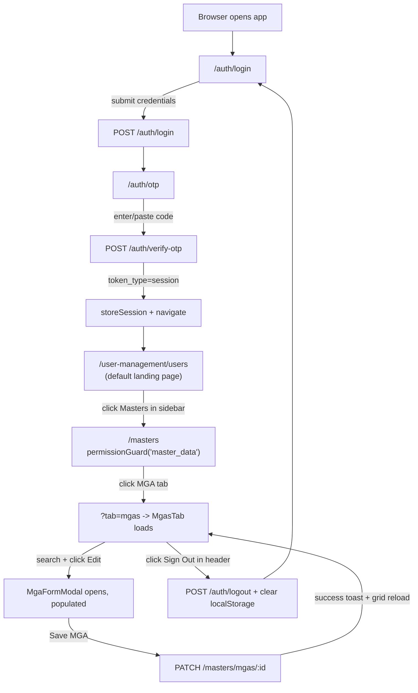

---

## 19. Diagrams

Rather than repeat every diagram a second time in one giant chapter, this section indexes where each Mermaid diagram already lives (each is authored directly against the real code paths in its owning chapter) and adds the two truly cross-cutting diagrams that don't belong to any single feature.

### Index of diagrams already embedded in this document

| Diagram | Type | Location |
|---|---|---|
| High-level frontend architecture (main.ts → Router → MainLayout → features) | `flowchart` | Chapter 1 |
| Login → OTP → Session/Challenge sequence | `sequenceDiagram` | Chapter 3 |
| Dashboard's (nonexistent) data-loading sequence | `flowchart` | Chapter 4 |
| User Management component hierarchy | `flowchart` | Chapter 5 §5.1 |
| Deactivate a single user, end-to-end | `sequenceDiagram` | Chapter 5 §5.2 |
| Masters tab-switch → generic simple-entity render | `flowchart` | Chapter 6 §6.7 |
| Add a new simple-entity record (e.g. LOB), end-to-end | `sequenceDiagram` | Chapter 6 §6.7 |
| Edit an MGA, end-to-end | `sequenceDiagram` | Chapter 7 |
| Chart of Accounts data/action flow | `flowchart` | Chapter 8 §8.1 |
| Journal Entries list → detail → post flow | `flowchart` | Chapter 8 §8.2 |
| Test Balance / `TestBalanceState` data flow | `flowchart` | Chapter 8 §8.3 |
| Reinsurance Calculations workbook → tab → post-to-JE flow | `flowchart` | Chapter 8 §8.4 |
| Full application routing tree | `flowchart` | Chapter 11 §11.4 |
| Complete user journey (login → Masters → edit → logout) | `flowchart` | Chapter 18 |

### Component Hierarchy (whole application, top two levels)

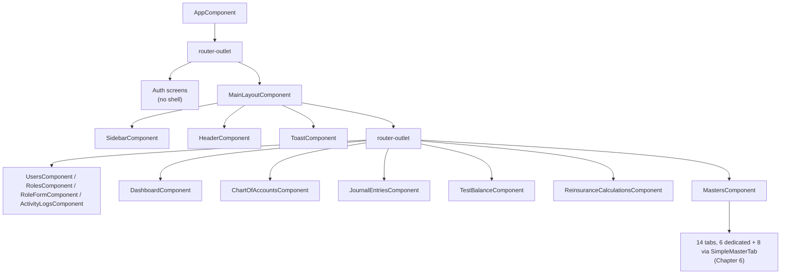

### API Call Flow (generic shape, applies to nearly every feature in this document)

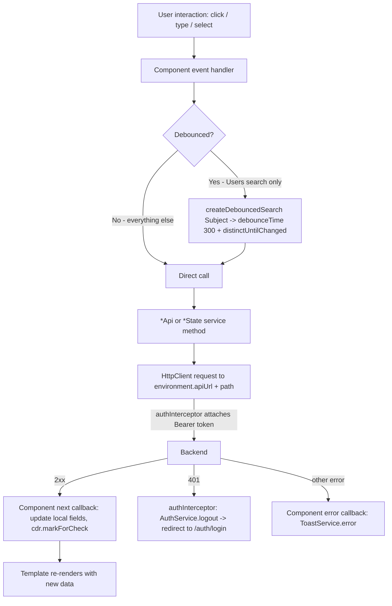

Every diagram in this document was authored directly against the file paths, class names, and method names cited alongside it — none are generic Angular-textbook diagrams; each reflects this specific codebase's actual control flow.

---

## 20. Developer Handover Notes

### Folder & naming conventions (from the project's own `README.md`, verified against the actual tree)

| Thing | Convention | Example |
|---|---|---|
| Components | No `.component.` suffix, `kebab-case` file, `PascalCase` class (Angular 20+ default schematic) | `masters.ts` / `class Masters` — note: many *older* files in this codebase still use the pre-20 `*.component.ts` suffix (e.g. `users.component.ts`, `login.component.ts`); both styles coexist, so don't be surprised to see either |
| API services | `*-api.ts` | `chart-of-accounts-api.ts` |
| State services | `*-state.ts` | `test-balance-state.ts`, `mgas-state.ts` |
| Grid config services | `*-grid.ts` | introduced when a feature's ag-Grid config grows large enough to extract |
| Form services | `*-form.ts` | `masters/forms/mga-form.ts` |
| Models | `*.model.ts` | `journal-entry.model.ts` |
| Utilities | `*.util.ts` | `csv-export.util.ts`, `label-fns.util.ts`, `debounced-search.util.ts` |

### Styling rule
No inline `style="..."` in templates and no inline `styles: [...]` in `@Component` decorators. A style used by more than one component belongs in `src/styles/*.scss`; a style specific to one component stays in that component's own `.scss` file.

### Where a service/model lives when more than one feature needs it
It stays in whichever feature is its most natural owner — it does **not** get centralized into `core/` just because a second feature needs it. Concrete examples already in this codebase: `ChartOfAccountsApi` lives in `chart-of-accounts/` but is imported by `journal-entries` and `masters`; `MgasApi` and `TreatiesApi` live in `masters/` but are imported by `journal-entries` and `reinsurance-calculations`; `DocumentTypesApi` lives in `masters/` but is imported by `chart-of-accounts`. `core/` is reserved for things every feature needs regardless of domain (auth, guards, interceptors, ag-Grid defaults).

### Adding a new feature (from the README, still accurate)
1. Create `features/<name>/` with `models/` and `services/` subfolders as needed — don't pre-create empty folders for concerns the feature doesn't have yet.
2. Put the main routed page component at `features/<name>/<name>.ts` (+ `.html`/`.scss`/`.spec.ts`). Sub-components go under `features/<name>/components/<sub-name>/`.
3. If the feature calls a backend endpoint, add `features/<name>/services/<name>-api.ts`. If it needs to be consumed by another feature, that feature imports it directly rather than duplicating/hoisting it into `core/`.
4. If the feature holds data that multiple parts of its own UI need to react to, add an RxJS `BehaviorSubject`-backed `features/<name>/services/<name>-state.ts` between the component and the API service (see `TestBalanceState`, Chapter 16 §16.3, for the reference pattern) — but note the Masters feature shows this is optional: plain-field state services (Chapter 16 §16.3 Variant B) are a legitimate lighter-weight alternative when only one component consumes the data.
5. Add the route to `app.routes.ts` (or the feature's own `<name>.routes.ts` if it has sub-routes, or a query-param-driven internal switch like Masters if it has many flat "tabs") using `loadComponent`/`loadChildren` — every route is lazy-loaded.
6. Write specs alongside every new file.

### How to add a new page inside an existing feature
Follow the Masters pattern if it's a "tab" among similar siblings (add a `MasterTab` enum value + either reuse `SimpleMasterTab` with a new `SimpleMode`, or build a dedicated `*-tab` component if the entity has meaningfully different fields/relationships — see the decision already made for Treaties/MGAs/States/GlMappings/RiskCompanies/LockedPeriods vs. the 8 simple entities in Chapter 6). Otherwise, follow the User Management pattern: add a route in the feature's `*.routes.ts`, a new `loadComponent` entry, and link to it from wherever makes sense in the existing UI.

### How to add a new API integration
Add a method to the relevant feature's `*-api.ts` (or create a new one if it's a new resource), following the existing shape: `@Injectable({ providedIn: 'root' })`, `private http = inject(HttpClient)`, a `base` string built from `environment.apiUrl`, and a method returning `this.http.get/post/patch/delete<ResponseType>(url, ...)`. Do not add error handling inside the `*-api.ts` method itself — every example in this codebase handles success/error at the call site (component or `*-state.ts`), not inside the API service.

### Important / frequently touched files
- `src/app/app.routes.ts` — every new top-level feature route goes here.
- `src/app/core/services/auth.service.ts` — the single source of truth for session/permission logic; touched whenever permission rules change.
- `src/app/core/guards/permission.guard.ts` — touched whenever a new module-level permission gate is needed.
- `src/environments/environment.ts` / `environment.prod.ts` — the only files that should change between local/dev and production API URLs.
- `src/app/shared/components/confirm-dialog/` and `src/app/shared/components/toast/` — reused by nearly every destructive action and every success/error message in the app; a change here has app-wide blast radius.
- `src/app/core/services/ag-grid-config.service.ts` — defines the default pagination page size (10) and page-size options for every grid in the app; a global grid behavior change starts here.

### Known gaps and dead code worth knowing before you go looking for them
- `UsersComponent.openBulkDeactivate()`/`clearSelection()` are fully implemented but **have no button wired to them** in the template (Chapter 5 §5.2) — the checkbox column works, bulk deactivate does not currently have a UI entry point.
- `RolePermissionsModalComponent` (Chapter 5 §5.1) exists but is not referenced by any route or parent component — role editing goes through the full-page `RoleFormComponent` instead.
- `JournalEntriesComponent`'s "Print Register" button and `selectedState`/`selectedAmountRange` filter fields have no wired behavior (Chapter 8 §8.2).
- `TestBalanceState.error$` is populated on failure but never subscribed to by `TestBalanceComponent` — failed loads fail silently in the UI (Chapter 8 §8.3.1).
- Several `ReinsuranceApi` methods (`updateRates`, `updateMappings`, `updateExhibit`, database seed/clear endpoints, `getPrograms`) exist but are not called from `ReinsuranceCalculationsComponent` — the Parameters/Rates/Mappings panels there are read-only display only (Chapter 8 §8.4).
- The Dashboard (Chapter 4) is a static placeholder with zero logic — if asked to "add a dashboard widget," there is no existing pattern in that folder to extend; look to `test-balance/` or `chart-of-accounts/` for the closest analogous data-loading pattern instead.

### How to debug this project
1. **Network issues / wrong API responses**: check `src/environments/environment.ts`'s `apiUrl` first, then check `authInterceptor` (Chapter 17) — a silent 401-triggered logout is a common source of "why did I get bounced to login" confusion.
2. **"Why can't I see this menu item / why was I redirected to /dashboard"**: it's almost always `permissionGuard` or `AuthService.hasPermission()` (Chapter 17) — check the user's `sl_current_user` localStorage entry's `permissions`/`effective_permissions` array, and confirm you're checking the right `module`/`action` pair against `PermissionsApi.getModules()`'s known module ids.
3. **"Why did my search/filter not update the grid"**: check whether the tab's search field is server-side (most Masters tabs, Chart of Accounts) or purely client-side (GL Mappings, the Treaties MGA filter) — see the "Search/filter/pagination" subsection of the relevant chapter before assuming a bug.
4. **"Why do I see randomized-looking IP/device/location data in Activity Logs"**: that's `injectMockData()` (Chapter 10) backfilling fields the backend didn't return — not a bug, but also not real data.
5. Run `npm run lint` and `npm run test:coverage` before committing — a pre-commit Husky hook already runs ESLint + Prettier on staged files, but the full test suite is not run automatically.
